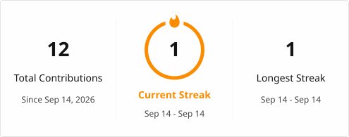

  <h1>Adam</h1>
  <h3>DBRE & DBA SR</h3>
  

    
    
    
    
     
      
    
 
  

---

## Sobre mim

  

---

## Skills

  
  

<table width="100%">
<tr>
<td valign="top" width="40%">
<h2>Ferramentas</h2>
<table width="100%">
<tr><td><b>Bancos de dados</b></td><td></td></tr>
<tr><td><b>Linguagens</b></td><td></td></tr>
<tr><td><b>Cloud</b></td><td></td></tr>
<tr><td><b>DevOps</b></td><td></td></tr>
<tr><td><b>Observabilidade</b></td><td></td></tr>
<tr><td><b>Controle de versão</b></td><td></td></tr>
<tr><td><b>IDEs</b></td><td></td></tr>
<tr><td><b>Sistemas operacionais</b></td><td></td></tr>
</table>
</td>
<td valign="top" width="60%">
<h2>Certificações</h2>
<table width="100%">
<tr><th>AWS</th><th>Microsoft Azure</th></tr>
<tr><td>Solutions Architect – Associate</td><td>Azure Administrator Associate (AZ-104)</td></tr>
<tr><td>Developer – Associate</td><td>Azure Database Administrator Associate (DP-300)</td></tr>
<tr><td>Data Engineer – Associate</td><td>Azure Fundamentals (AZ-900)</td></tr>
<tr><td>Cloud Practitioner</td><td>Azure Data Fundamentals (DP-900)</td></tr>
</table>
<h2>Formação</h2>
<table width="100%">
<tr><th>Curso</th><th>Instituição</th><th>Período</th></tr>
<tr><td>Pós-graduação em Engenharia de Dados</td><td>PUC Minas</td><td>jun/2025 – jun/2026</td></tr>
<tr><td>Pós-graduação em Cloud Computing</td><td>PUC Minas</td><td>jun/2023 – dez/2024</td></tr>
<tr><td>Bacharelado em Sistemas de Informação</td><td>Faculdade Pitágoras</td><td>2015 – 2018</td></tr>
<tr><td>Técnico em Programação</td><td>SENAI</td><td>2012 – 2014</td></tr>
</table>
</td>
</tr>
</table>

---

## GitHub

  

  
      

  

---
