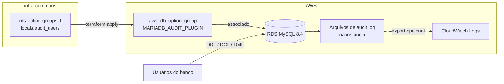
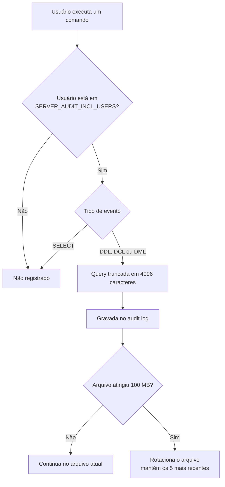
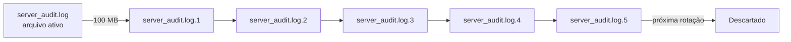
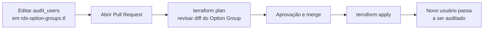

# Auditoria do RDS MySQL com MariaDB Audit Plugin via Terraform


> Configuração automatizada da auditoria do **Amazon RDS MySQL** com o **MariaDB Audit Plugin**, gerenciada por **Terraform** para garantir consistência, rastreabilidade e controle centralizado.

> [!NOTE]
> Nomes de empresa, repositórios, recursos e usuários são fictícios. O único nome real é `adam.rodrigues`, autor desta documentação. Os demais (`segundo.usuario`, `terceiro.usuario` etc.) são apenas exemplos.

---

## Sumário

1. [Objetivo](#1-objetivo)
2. [Arquitetura](#2-arquitetura)
3. [Estrutura do repositório](#3-estrutura-do-repositório)
4. [Configuração do plugin](#4-configuração-do-plugin)
5. [Usuários auditados](#5-usuários-auditados)
6. [Código Terraform](#6-código-terraform)
7. [Como incluir um usuário na auditoria](#7-como-incluir-um-usuário-na-auditoria)
8. [Consulta dos logs](#8-consulta-dos-logs)
9. [Observações](#9-observações)

---

## 1. Objetivo

Registrar operações sensíveis executadas no banco para um conjunto específico de usuários, garantindo transparência, segurança e atendimento a requisitos de conformidade, além de facilitar investigações e auditorias internas.

| Categoria | Comandos | Auditado |
|-----------|----------|:--------:|
| **DDL** | `CREATE`, `ALTER`, `DROP`, `TRUNCATE` | Sim |
| **DCL** | `GRANT`, `REVOKE` | Sim |
| **DML** | `INSERT`, `UPDATE`, `DELETE` | Sim |
| **Consulta** | `SELECT` | Não |

O **MariaDB Audit Plugin** é suportado nativamente pelo Amazon RDS para MySQL a partir da versão 8.0.

---

## 2. Arquitetura

### 2.1 Visão geral



### 2.2 Como um evento é auditado



### 2.3 Rotação dos arquivos



---

## 3. Estrutura do repositório

```text
infra-commons/
├── modules/
│   └── ...
└── provider/
    └── aws/
        └── environments/
            ├── dev/
            │   └── ...
            └── prod/
                ├── outros-arquivos.tf
                ├── rds.tf
                └── rds-option-groups.tf
```

| Arquivo | Responsabilidade |
|---------|------------------|
| `rds.tf` | Definição da instância RDS e associação ao Option Group |
| `rds-option-groups.tf` | Lista de usuários auditados (`locals.audit_users`) e Option Group com o plugin |

---

## 4. Configuração do plugin

A auditoria é implementada pelo recurso `aws_db_option_group`, com a opção `MARIADB_AUDIT_PLUGIN` habilitada.

| Parâmetro | Valor | Descrição |
|-----------|-------|-----------|
| `SERVER_AUDIT_EVENTS` | `QUERY_DDL,QUERY_DCL,QUERY_DML_NO_SELECT` | Registra alterações de schema, permissões e comandos que modificam dados, exceto `SELECT` |
| `SERVER_AUDIT_FILE_ROTATE_SIZE` | `104857600` | Tamanho máximo de cada arquivo: 100 MB |
| `SERVER_AUDIT_FILE_ROTATIONS` | `5` | Quantidade de arquivos mantidos |
| `SERVER_AUDIT_INCL_USERS` | `join(",", local.audit_users)` | Apenas os usuários da lista são auditados |
| `SERVER_AUDIT_QUERY_LOG_LIMIT` | `4096` | Tamanho máximo registrado por query, em caracteres |

---

## 5. Usuários auditados

A auditoria se aplica apenas aos usuários definidos em `local.audit_users`, uma lista centralizada no bloco `locals` do Terraform. Isso facilita a manutenção dos usuários monitorados.

| Usuário |
|---------|
| `adam.rodrigues` |
| `segundo.usuario` |
| `terceiro.usuario` |
| `quarto.usuario` |
| `quinto.usuario` |
| `sexto.usuario` |
| `setimo.usuario` |
| `oitavo.usuario` |
| `nono.usuario` |
| `decimo.usuario` |

---

## 6. Código Terraform

**Arquivo:** `infra-commons/provider/aws/environments/prod/rds-option-groups.tf`

```hcl
locals {
  audit_users = [
    "adam.rodrigues",
    "segundo.usuario",
    "terceiro.usuario",
    "quarto.usuario",
    "quinto.usuario",
    "sexto.usuario",
    "setimo.usuario",
    "oitavo.usuario",
    "nono.usuario",
    "decimo.usuario",
  ]
}

resource "aws_db_option_group" "empresa1_mysql_audit_plugin" {
  name                     = "empresa1-audit-mariadb-plugin"
  engine_name              = "mysql"
  major_engine_version     = "8.4"
  option_group_description = "Option Group for Empresa1 Master MySQL 8.4 managed by Terraform"

  option {
    option_name = "MARIADB_AUDIT_PLUGIN"

    option_settings {
      name  = "SERVER_AUDIT_EVENTS"
      value = "QUERY_DDL,QUERY_DCL,QUERY_DML_NO_SELECT"
    }

    option_settings {
      name  = "SERVER_AUDIT_FILE_ROTATE_SIZE"
      value = "104857600"
    }

    option_settings {
      name  = "SERVER_AUDIT_FILE_ROTATIONS"
      value = "5"
    }

    option_settings {
      name  = "SERVER_AUDIT_INCL_USERS"
      value = join(",", local.audit_users)
    }

    option_settings {
      name  = "SERVER_AUDIT_QUERY_LOG_LIMIT"
      value = "4096"
    }
  }

  tags = {
    Environment = local.account_name
  }
}
```

A instância RDS precisa referenciar o Option Group em `rds.tf`:

```hcl
resource "aws_db_instance" "empresa1_master" {
  option_group_name = aws_db_option_group.empresa1_mysql_audit_plugin.name
}
```

---

## 7. Como incluir um usuário na auditoria



1. Abra o arquivo `infra-commons/provider/aws/environments/prod/rds-option-groups.tf`.
2. Adicione o usuário na lista `audit_users`, mantendo a ordem alfabética.
3. Abra um Pull Request e confira no `terraform plan` que apenas o valor de `SERVER_AUDIT_INCL_USERS` mudou.
4. Após aprovação, aplique com `terraform apply`.

> [!TIP]
> O nome informado deve ser exatamente o usuário MySQL (a parte antes do `@` em `usuario@host`).

---

## 8. Consulta dos logs

Os logs ficam armazenados na própria instância e podem ser listados e baixados pela AWS CLI:

```bash
aws rds describe-db-log-files \
  --db-instance-identifier empresa1-master \
  --filename-contains audit
```

```bash
aws rds download-db-log-file-portion \
  --db-instance-identifier empresa1-master \
  --log-file-name audit/server_audit.log \
  --starting-token 0 \
  --output text
```

Formato de cada linha do log:

```text
timestamp,serverhost,username,host,connectionid,queryid,operation,database,object,retcode
```

Exemplo:

```text
20260919 13:20:45,empresa1-master,segundo.usuario,10.194.9999.9999,1234,56789,QUERY,empresa1,'ALTER TABLE tenant ADD COLUMN plan_tier INT NULL',0
```

Para centralizar e reter os logs por mais tempo, habilite a exportação para o CloudWatch na instância:

```hcl
resource "aws_db_instance" "empresa1_master" {
  enabled_cloudwatch_logs_exports = ["audit"]
}
```

---

## 9. Observações

- O plugin é aplicado por meio de um **Option Group**, que precisa estar associado à instância RDS.
- A auditoria **não inclui `SELECT`**, para evitar volume excessivo de logs.
- Os logs ficam na instância e são rotacionados; sem exportação para o CloudWatch, os arquivos mais antigos são descartados.

> [!WARNING]
> Com rotação de 5 arquivos de 100 MB, a instância guarda no máximo cerca de **500 MB** de auditoria. Em períodos de muitas alterações, o histórico local pode cobrir poucos dias. Para retenção longa, use o export para o CloudWatch.
