# Estudo de utilização da Primary durante o horário comercial

> Os nomes de empresa, instância, usuários, hosts, tabelas, colunas e projetos apresentados neste documento são fictícios.

## 1. Objetivo

Este documento apresenta uma análise do comportamento da instância **Primary** durante o horário comercial, considerando o período entre **06:00 e 19:00**.

A data de **22/07/2026** foi utilizada como exemplo. Embora os valores possam variar entre os dias, o padrão observado normalmente é semelhante:

- utilização moderada durante a maior parte do período.
- picos pontuais de carga.
- aumento de IOPS, throughput e concorrência em determinados horários.
- presença recorrente das queries JPA utilizadas pelo **Projeto Web** entre as maiores consumidoras de carga.

Esta análise complementa o estudo anterior, que considerou apenas uma janela curta do horário de pico. Aqui, o objetivo é entender o comportamento do banco ao longo de todo o período comercial.

---

## 2. Escopo da análise

| Item | Informação |
|---|---|
| Instância | `empresa1-primary-8` |
| Engine | MySQL Community 8.4.5 |
| Classe | `db.m8g.24xlarge` |
| Capacidade indicada no Performance Insights | 96 vCPUs |
| Data utilizada como exemplo | 22/07/2026 |
| Período analisado | 06:00 às 19:00 |
| Tipo de análise | Comportamento agregado do horário comercial |

As evidências consideradas incluem:

- utilização de CPU.
- carga do banco em Average Active Sessions (AAS).
- operações de I/O.
- throughput de I/O.
- throughput de rede.
- Top SQL.
- Top users.
- Top hosts.

> Os valores apresentados neste documento são aproximados e foram obtidos visualmente a partir dos gráficos.

---

## 3. Consideração importante sobre agregação e média

Ao analisar uma janela extensa, como o período entre 06:00 e 19:00, o Performance Insights e o CloudWatch precisam consolidar uma quantidade maior de amostras no mesmo gráfico.

Dependendo da métrica, da estatística selecionada e da granularidade utilizada pela AWS, os pontos exibidos podem representar médias ou consolidações de vários valores coletados dentro de um intervalo.

Isso pode diluir picos de curta duração.

Um exemplo é o comportamento observado próximo das 12:00:

- na análise anterior, utilizando uma janela curta de poucos minutos, a carga chegou a aproximadamente **650 AAS**.
- na visualização de 13 horas, o mesmo horário aparece com um valor muito menor, próximo de **55 AAS**.

Essa diferença não significa que o pico deixou de existir. Significa que, ao ampliar a janela, o pico pontual pode ser incorporado à média de um intervalo maior.

Por esse motivo:

- gráficos de longo período são adequados para avaliar o comportamento geral.
- gráficos de curto período são necessários para investigar incidentes e picos.
- médias diárias ou horárias não devem ser utilizadas isoladamente para dimensionar a capacidade.
- a análise de capacidade deve considerar também valores máximos, duração dos picos e impacto operacional.

---

## 4. Resumo executivo

Durante a maior parte do horário comercial, a Primary não utiliza toda a capacidade disponível da máquina ou do armazenamento.

Entretanto, o ambiente possui uma carga caracterizada por picos. Durante esses períodos, processos inadequados, excesso de simultaneidade ou queries de alto custo podem elevar rapidamente:

- Average Active Sessions.
- CPU.
- operações de leitura e escrita.
- throughput de armazenamento.
- quantidade de sessões concorrentes.
- tempo de resposta das aplicações.

O gráfico de carga mostra que a maior parte do dia permaneceu abaixo da linha de 96 vCPUs, normalmente entre aproximadamente 5 e 20 AAS. Ainda assim, houve um pico próximo das 07:00 que alcançou aproximadamente 135 AAS, ultrapassando a capacidade indicada de vCPU.

Os demais gráficos mostram picos frequentes de operações de I/O, throughput de disco e rede, mesmo quando a CPU permanece relativamente baixa.

As duas queries com maior AAS médio no Top SQL da janela são queries JPA relacionadas ao **Projeto Web**.

Esse resultado é relevante porque demonstra que essas consultas não aparecem apenas durante um incidente isolado. Elas permanecem entre as principais consumidoras de carga ao longo do horário comercial.

---

## 5. Utilização de CPU

Durante a maior parte do período, a CPU permaneceu aproximadamente entre 8% e 18%, com alguns picos pontuais próximos de 20% a 25%.

<picture>
  <source media="(prefers-color-scheme: dark)" srcset="../../../assets/estudo-iops-primary-horario-comercial/cpu-utilization-dark.svg">
  <source media="(prefers-color-scheme: light)" srcset="../../../assets/estudo-iops-primary-horario-comercial/cpu-utilization-light.svg">
  
</picture>

*Utilização de CPU entre 06:00 e 19:00*

### Interpretação

A utilização relativamente baixa durante boa parte do dia mostra que a carga não é constante.

Isso não significa que a instância esteja necessariamente superdimensionada. Em ambientes transacionais, a capacidade também precisa absorver:

- picos de acessos simultâneos.
- processos executados em lote.
- consultas inadequadas.
- transações concorrentes.
- eventos não previstos.
- períodos em que vários serviços elevam a carga ao mesmo tempo.

A média de CPU do período não representa adequadamente o risco dos horários de pico.

Além disso, um banco pode apresentar alta carga em AAS sem atingir 100% de CPU, porque parte das sessões pode estar aguardando armazenamento, commit, locks ou outros recursos internos.

---

## 6. Carga do banco

A carga permaneceu predominantemente entre aproximadamente 5 e 20 AAS durante a maior parte do dia.

Foram observados alguns eventos pontuais:

| Horário aproximado | Carga observada | Interpretação |
|---|---:|---|
| 07:00 | 135 AAS | Pico acima das 96 vCPUs |
| 10:00 | 40 AAS | Evento pontual |
| 12:00 | 55 AAS | Valor agregado da janela extensa |
| 13:00 | 20 a 25 AAS | Pequeno aumento |
| 14:00 | 20 a 25 AAS | Período de maior atividade relativa |
| Restante do dia | 5 a 20 AAS | Comportamento predominante |

<picture>
  <source media="(prefers-color-scheme: dark)" srcset="../../../assets/estudo-iops-primary-horario-comercial/database-load-dark.svg">
  <source media="(prefers-color-scheme: light)" srcset="../../../assets/estudo-iops-primary-horario-comercial/database-load-light.svg">
  
</picture>

*Carga do banco entre 06:00 e 19:00*

### Estados predominantes

O gráfico apresenta participação principalmente dos seguintes estados:

- `executing`.
- `statistics`.
- `starting`.
- `waiting for handler commit`.
- `Opening tables`.
- `update`.
- `Waiting for table metadata lock`.
- `preparing`.
- `optimizing`.
- `freeing items`.

### Interpretação

O pico próximo das 07:00 ultrapassou a linha de 96 vCPUs, mostrando que mesmo em um dia com utilização média moderada podem existir intervalos de saturação ou fila elevada.

No restante do período, a carga ficou abaixo da capacidade indicada. Porém, isso não elimina o risco operacional, porque:

- os picos podem ser muito curtos e aparecer diluídos.
- a carga pode crescer rapidamente.
- processos inadequados podem gerar efeitos desproporcionais.
- a concorrência pode aumentar sem crescimento equivalente da CPU.
- waits de commit, armazenamento ou metadados podem limitar o banco antes da CPU.

---

## 7. Operações de I/O

O volume agregado de operações de leitura e escrita apresentou variações frequentes durante todo o período.

Os maiores picos ficaram próximos de **9.400 operações por segundo**.

<picture>
  <source media="(prefers-color-scheme: dark)" srcset="../../../assets/estudo-iops-primary-horario-comercial/ebs-io-operations-dark.svg">
  <source media="(prefers-color-scheme: light)" srcset="../../../assets/estudo-iops-primary-horario-comercial/ebs-io-operations-light.svg">
  
</picture>

*Operações EBS por segundo*

### Interpretação

O armazenamento não permaneceu no pico durante todo o horário comercial. Entretanto, houve diversos intervalos de elevação, principalmente próximos do meio-dia e em outros momentos de maior atividade.

Esse comportamento reforça que a carga é intermitente.

Mesmo quando a média do período parece confortável, um processo inadequado ou a combinação de várias execuções simultâneas pode aproximar rapidamente o banco dos limites de IOPS.

Para determinar se houve saturação efetiva, as operações por segundo devem ser analisadas em conjunto com:

- IOPS provisionados.
- Read Latency.
- Write Latency.
- Disk Queue Depth.
- throughput provisionado.
- waits relacionados a commit e armazenamento.

---

## 8. Throughput de I/O

O throughput agregado de leitura e escrita atingiu picos próximos de **155,5 MB/s**.

<picture>
  <source media="(prefers-color-scheme: dark)" srcset="../../../assets/estudo-iops-primary-horario-comercial/io-throughput-dark.svg">
  <source media="(prefers-color-scheme: light)" srcset="../../../assets/estudo-iops-primary-horario-comercial/io-throughput-light.svg">
  
</picture>

*Throughput de I/O*

Durante a maior parte do período, o volume ficou abaixo do máximo observado, mas apresentou elevações frequentes.

### Interpretação

Assim como no gráfico de operações por segundo, o throughput mostra que o armazenamento não é utilizado de forma constante.

A existência de capacidade ociosa em parte do dia não impede que o ambiente enfrente risco nos momentos em que:

- várias operações pesadas são executadas simultaneamente.
- queries leem ou alteram volumes elevados de dados.
- processos inadequados aumentam a escrita.
- transações permanecem abertas por mais tempo.
- ocorre aumento de commits e concorrência.

---

## 9. Throughput de rede

O throughput agregado de rede atingiu picos próximos de **160,1 MB/s**.

<picture>
  <source media="(prefers-color-scheme: dark)" srcset="../../../assets/estudo-iops-primary-horario-comercial/network-throughput-dark.svg">
  <source media="(prefers-color-scheme: light)" srcset="../../../assets/estudo-iops-primary-horario-comercial/network-throughput-light.svg">
  
</picture>

*Throughput de rede*

### Interpretação

A rede também apresenta comportamento variável, com picos próximos dos períodos de maior atividade.

Não há evidência, apenas por este gráfico, de utilização constante do limite de rede. Ainda assim, o aumento do tráfego pode acompanhar consultas que retornam grande volume de dados ou períodos com grande quantidade de chamadas simultâneas.

O dado deve ser correlacionado com:

- tamanho dos resultados.
- quantidade de chamadas.
- serviços de origem.
- endpoints.
- volume de linhas retornadas.
- reutilização ou repetição das mesmas informações.

---

## 10. Top SQL do horário comercial

As duas primeiras posições do Top SQL são ocupadas por queries JPA relacionadas ao **Projeto Web**.

<picture>
  <source media="(prefers-color-scheme: dark)" srcset="../../../assets/estudo-iops-primary-horario-comercial/top-sql-dark.svg">
  <source media="(prefers-color-scheme: light)" srcset="../../../assets/estudo-iops-primary-horario-comercial/top-sql-light.svg">
  
</picture>

*Top SQL entre 06:00 e 19:00*

### Principais comandos observados

| Ordem | Comando resumido | AAS médio | Calls/s | Classificação |
|---:|---|---:|---:|---|
| 1 | `SELECT DISTINCTROW ...` | 0,50 | 3,10 | Projeto Web JPA |
| 2 | `SELECT COUNT(DISTINCTROW(...)) FROM store ...` | 0,49 | 3,11 | Projeto Web JPA |
| 3 | `COMMIT` | 0,34 | 0,33 | Transacional |
| 4 | `SELECT acc.id, evt.seq_number ...` | 0,32 | 24,87 | Validação de registro |
| 5 | `SELECT t0.ID, COUNT(t3.ID) FROM account ...` | 0,28 | 4,19 | Consulta JPA |
| 6 | `SELECT p.id FROM account ...` | 0,28 | 2.062,72 | Consulta de alta frequência |
| 7 | `SELECT a.id, a.begin_date ...` | 0,25 | 0,87 | Consulta funcional |
| 8 | `SELECT acc.id, acc.title ...` | 0,24 | 1,90 | Consulta funcional |

Também aparecem consultas com alta frequência, incluindo aproximadamente:

- 745,90 chamadas por segundo em uma consulta relacionada a `store_transfer`.
- 661,08 chamadas por segundo em uma consulta relacionada a `group_transfer`.
- 459,73 chamadas por segundo em uma consulta relacionada a `substitution`.

### Interpretação

O valor de AAS exibido no Top SQL representa a participação média ao longo da janela selecionada. Por isso, os valores são menores do que os observados em análises de poucos minutos.

Mesmo com a diluição causada pelo período de 13 horas, as duas queries JPA do Projeto Web permanecem no topo da carga.

Isso indica um problema recorrente e estrutural, e não apenas uma ocorrência isolada no horário de pico.

A quantidade de chamadas por segundo também deve ser interpretada com cuidado:

- uma query pode ter muitas execuções e baixo custo individual.
- uma query menos frequente pode ter custo elevado e maior AAS.
- frequência, duração, linhas examinadas e AAS devem ser avaliados em conjunto.

---

## 11. Situação atual do Projeto Web

Atualmente existem duas versões do Projeto Web:

1. **Projeto Web legado**.
2. **Projeto Web beta**.

A maioria das queries problemáticas já foi reescrita e disponibilizada no Projeto Web beta.

Entretanto:

- o Projeto Web legado continua em utilização.
- o Projeto Web beta não resolve todos os problemas funcionais e de performance.
- nenhuma das duas versões atende integralmente às necessidades atuais.
- realizar uma nova rodada de reescritas pontuais nas queries existentes não representa uma solução definitiva.
- manter duas implementações aumenta a complexidade operacional e de manutenção.

### Direcionamento recomendado

A solução estrutural é o desenvolvimento do **novo Projeto Web**.

Esse projeto deve consolidar:

- requisitos funcionais das duas versões atuais.
- regras de negócio.
- consultas otimizadas.
- controle de paginação.
- redução do volume de dados consultado.
- limitação de execuções simultâneas.
- critérios de performance.
- testes de carga.
- observabilidade por endpoint e serviço.
- plano de migração e desativação das versões antigas.

Novas reescritas pontuais podem até reduzir sintomas específicos, mas não devem ser consideradas a estratégia principal, porque grande parte desse trabalho já foi realizada no Projeto Web beta sem eliminar o problema como um todo.

---

## 12. Top users

O usuário `application-user1` apresentou a maior participação média na carga durante o período.

<picture>
  <source media="(prefers-color-scheme: dark)" srcset="../../../assets/estudo-iops-primary-horario-comercial/top-users-dark.svg">
  <source media="(prefers-color-scheme: light)" srcset="../../../assets/estudo-iops-primary-horario-comercial/top-users-light.svg">
  
</picture>

*Top users entre 06:00 e 19:00*

| Usuário/serviço | AAS médio |
|---|---:|
| `application-user1` | 7,85 |
| `application-user2` | 2,57 |
| `application-user3` | 1,83 |
| `application-user4` | 0,37 |
| `application-user5` | 0,28 |
| `application-user6` | 0,13 |
| `application-user7` | 0,11 |
| `application-user8` | 0,04 |
| `application-user9` | 0,02 |
| `application-user10` | < 0,01 |

### Interpretação

O `application-user1` concentra a maior parte da carga média do horário comercial e deve ser correlacionado com as queries do Projeto Web.

Os usuários `application-user2` e `application-user3` também possuem participação relevante, mas ficaram abaixo do `application-user1` na janela analisada.

A associação definitiva entre query, serviço e funcionalidade deverá ser confirmada utilizando:

- usuário do banco.
- host de origem.
- endpoint.
- logs da aplicação.
- identificadores de trace.
- comentários ou tags nas queries, quando disponíveis.

---

## 13. Top hosts

A carga aparece distribuída entre diversos hosts, sem que apenas um endereço concentre toda a utilização.

<picture>
  <source media="(prefers-color-scheme: dark)" srcset="../../../assets/estudo-iops-primary-horario-comercial/top-hosts-dark.svg">
  <source media="(prefers-color-scheme: light)" srcset="../../../assets/estudo-iops-primary-horario-comercial/top-hosts-light.svg">
  
</picture>

*Top hosts entre 06:00 e 19:00*

Os maiores hosts individuais ficaram próximos de 0,57 a 0,68 AAS médio.

> Os endereços IP foram mascarados mantendo apenas os dois primeiros octetos.

### Interpretação

A distribuição entre vários endereços sugere que a carga pode estar sendo originada por múltiplas instâncias da aplicação.

Isso torna importante mapear cada IP para:

- aplicação.
- deployment.
- pod ou instância.
- ambiente.
- versão do Projeto Web utilizada.
- endpoint responsável.

Sem esse mapeamento, o Top hosts identifica a origem técnica da conexão, mas não determina diretamente qual funcionalidade gerou a query.

---

## 14. Capacidade média versus risco de pico

Os gráficos mostram que os recursos não permanecem saturados durante todo o horário comercial.

Isso pode gerar a impressão de que aumentar capacidade é desnecessário. Entretanto, a decisão não deve considerar apenas a média.

A Primary precisa absorver:

- picos de acesso.
- execuções simultâneas.
- processos inadequados.
- crescimento de carga.
- eventos inesperados.
- períodos em que vários serviços pressionam o banco ao mesmo tempo.

O risco está justamente na diferença entre a utilização média e o pico.

Durante a maior parte do dia pode existir capacidade disponível, mas em um intervalo curto um processo inadequado pode:

- ultrapassar a quantidade de vCPUs em AAS.
- elevar IOPS e throughput.
- aumentar waits de commit.
- formar filas.
- aumentar o tempo de resposta.
- provocar timeout nas aplicações.
- gerar efeito cascata em outros serviços.

Portanto, a existência de períodos com baixa utilização não elimina a necessidade de margem operacional.

---

## 15. Aumento de recursos

O aumento de recursos de máquina ou armazenamento não corrige:

- queries JPA inadequadas.
- excesso de consultas simultâneas.
- volume desnecessário de dados.
- ausência de paginação.
- chamadas repetitivas.
- transações mal dimensionadas.
- problemas de arquitetura do Projeto Web.

O aumento fornece apenas uma **folga operacional**.

Essa folga pode:

- reduzir o risco imediato de indisponibilidade.
- aumentar a tolerância aos horários de pico.
- permitir que o banco absorva temporariamente processos inadequados.
- oferecer tempo para os times responsáveis atuarem.
- evitar que a correção precise ocorrer durante um incidente crítico.

Sem atuação dos times de Engenharia, a tendência é que o crescimento da carga volte a consumir a capacidade adicionada.

---

## 16. Responsabilidades e plano de ação

| Prioridade | Ação | Responsável | Objetivo |
|---|---|---|---|
| Crítica | Definir margem temporária de CPU, memória, IOPS e throughput | DBA/Infraestrutura | Reduzir risco imediato |
| Crítica | Priorizar o desenvolvimento do novo Projeto Web | Engenharia responsável | Resolver a causa estrutural |
| Alta | Mapear IPs do Top hosts para serviços, pods e versões do Projeto Web | Engenharia/Plataforma | Identificar origem exata |
| Alta | Correlacionar queries JPA com endpoints do Projeto Web | Engenharia/DBA | Medir impacto por funcionalidade |
| Alta | Criar critérios de performance para o novo Projeto Web | Engenharia/DBA | Evitar repetição do problema |
| Alta | Executar testes de carga antes da migração | Engenharia/QA | Validar comportamento em pico |
| Média | Revisar limites de concorrência e paginação | Engenharia | Reduzir simultaneidade e volume |
| Média | Manter alertas de AAS, CPU, IOPS, throughput e latência | DBA/Observabilidade | Detectar risco antecipadamente |
| Média | Definir plano de retirada do Projeto Web legado e beta | Produto/Engenharia | Reduzir duplicidade e manutenção |

---

## 17. Critérios recomendados para o novo Projeto Web

O novo Projeto Web deve possuir critérios técnicos de aceite, incluindo:

- não executar consultas sem paginação em grandes volumes.
- evitar carregamento de relacionamentos desnecessários pelo ORM.
- limitar a quantidade de registros retornados.
- reduzir o uso de `DISTINCTROW` e contagens complexas quando não forem necessárias.
- separar a consulta de dados da consulta de total quando apropriado.
- controlar a quantidade de requisições simultâneas.
- possuir timeout e cancelamento.
- identificar queries por endpoint.
- permitir rastreamento por serviço, usuário e host.
- executar testes com volume semelhante ao ambiente produtivo.
- validar AAS, CPU, IOPS, throughput e latência nos testes.
- possuir plano de migração das duas versões atuais.

---

## 18. Conclusão

A análise do horário comercial mostra que a Primary não permanece saturada durante todo o dia. A maior parte do período apresenta CPU e carga abaixo da capacidade total.

Entretanto, existem picos pontuais capazes de ultrapassar a quantidade de vCPUs em AAS e elevar rapidamente o consumo de armazenamento e rede.

As queries JPA do Projeto Web permanecem entre as maiores consumidoras de carga mesmo quando a análise considera uma janela de 13 horas. Isso confirma que o problema é recorrente.

A reescrita pontual dessas queries não deve ser tratada como solução principal, porque grande parte das consultas já foi reescrita no Projeto Web beta e, atualmente, nem a versão legada nem a beta resolvem integralmente os problemas.

A solução estrutural é o desenvolvimento do novo Projeto Web.

O aumento de recursos da Primary e do armazenamento pode ser adotado como mitigação temporária. Essa ação cria margem para os horários de pico e oferece tempo para que os times de Engenharia responsáveis implementem a solução definitiva.

A capacidade adicional não elimina a causa-raiz e deve estar vinculada a um plano de ação, responsáveis e prazos.
