# Estudo de utilização de recursos da Primary (horário de pico 12:00)

> Os nomes de empresa, instância, usuários, tabelas, colunas e queries deste documento são fictícios.

## 1. Objetivo

Este documento tem como objetivo analisar os problemas de capacidade e performance observados na instância **Primary** (`empresa1-primary-8`), identificando os serviços, queries e transações que mais pressionam o ambiente durante os horários de pico.

O cenário observado está relacionado principalmente à elevada quantidade de sessões e transações simultâneas, que ultrapassa a capacidade de processamento eficiente do banco.

O aumento de capacidade será tratado como uma **mitigação temporária**, para oferecer aos times de Desenvolvimento e Sustentação uma janela segura para corrigir os problemas identificados pelo DBA.

------------------------------------------------------------------------

# 2. Análise da Primary

## 2.1 Contexto do comparativo

Foi realizado um comparativo do mesmo horário de pico em duas datas:

- **02/07/2026:** janela utilizada como referência anterior.

- **21/07/2026:** janela mais recente, com aumento expressivo da carga.

As evidências incluem:

- carga do banco em Average Active Sessions **AAS**.

- utilização de CPU.

- operações e throughput de disco.

- throughput de rede.

- conexões/threads.

- estados de execução.

- Top SQL.

- Top users, utilizados como referência para identificar os serviços de origem.

## 2.2 Resumo executivo

O comparativo mostra que o incidente de **21/07/2026** não foi apenas um aumento comum de utilização.

A carga do banco passou de um pico aproximado de **70 AAS** em 02/07 para aproximadamente **650 AAS** em 21/07. Considerando a linha de referência de **96 vCPUs**, a carga mais recente chegou a aproximadamente **6,8 vezes a capacidade de execução paralela por CPU**.

Ao mesmo tempo:

- a CPU atingiu aproximadamente **70%**, sem chegar a 100%;

- o throughput agregado de I/O passou de aproximadamente **118,3 MB/s** para **248 MB/s**;

- o throughput agregado de rede teve aumento relativamente pequeno, de aproximadamente **320,8 MB/s** para **343,6 MB/s**;

- os estados de espera foram dominados por `waiting for handler commit`, acompanhados por `update`, `statistics`, `executing`, `opening tables`, `preparing` e `optimizing`;

- `COMMIT`, `INSERT INTO user_last_access` e `INSERT INTO event_log` passaram a concentrar uma parcela relevante da carga;

- os usuários/serviços `application-user1`, `application-user2`, `application-user3` e `application-user4` apresentaram aumento expressivo de AAS.

A combinação desses sinais indica um cenário de **alta concorrência transacional**, com grande quantidade de sessões simultâneas aguardando etapas internas do processamento e da confirmação das transações.

A CPU mais alta em 21/07 não explica sozinha o pico de aproximadamente 650 AAS. A diferença entre a carga e a utilização de CPU reforça que uma parte importante das sessões estava ativa, porém aguardando recursos ou etapas internas do banco.

## 2.3 Comparativo consolidado

| Indicador                   | 02/07/2026 | 21/07/2026 | Variação aproximada | Interpretação                                         |
| --------------------------- | ---------: | ---------: | ------------------: | ----------------------------------------------------- |
| Pico de carga do banco      |     70 AAS |    650 AAS |               +829% | Crescimento severo da concorrência                    |
| Relação AAS/vCPU            |      0,73x |      6,77x |                   - | Em 21/07, a carga ficou muito acima das 96 vCPUs      |
| Pico de CPU                 |        40% |        70% |            +30 p.p. | Maior processamento, porém sem saturação total de CPU |
| Throughput agregado de I/O  | 118,3 MB/s | 248,0 MB/s |               +110% | Volume de dados processado praticamente dobrou        |
| Throughput agregado de rede | 320,8 MB/s | 343,6 MB/s |                 +7% | Rede não cresceu na mesma proporção da carga          |
| `application-user1`         |   8,27 AAS |  73,79 AAS |                8,9x | Principal usuário/serviço na captura mais recente     |
| `application-user2`         |  11,83 AAS |  34,38 AAS |                2,9x | Aumento relevante de carga                            |
| `application-user3`         |   2,09 AAS |  25,04 AAS |               12,0x | Maior crescimento proporcional entre os principais    |
| `application-user4`         |   1,67 AAS |  11,19 AAS |                6,7x | Aumento relevante de carga                            |

> O comparativo de usuários representa as janelas selecionadas nos screenshots do Performance Insights. Os valores não devem ser interpretados como o total integral do pico de 650 AAS, mas como evidência da participação relativa dos serviços.

------------------------------------------------------------------------

## 2.4 Carga do banco

### 02/07/2026

Na janela de 02/07, o pico ficou próximo de **70 AAS**, abaixo da linha de referência de **96 vCPUs**.

Após o pico inicial, a carga permaneceu predominantemente entre aproximadamente 15 e 40 AAS. Havia atividade em `executing`, `statistics`, `waiting for handler commit`, `update` e outros estados, porém sem ultrapassar de forma sustentada a capacidade de CPU indicada no gráfico.

  <picture>
    <source media="(prefers-color-scheme: dark)" srcset="../../../assets/estudo-iops-primary-horario-de-pico-1200/db-load-2026-07-02-dark.svg" />
    <source media="(prefers-color-scheme: light)" srcset="../../../assets/estudo-iops-primary-horario-de-pico-1200/db-load-2026-07-02-light.svg" />
    
  </picture>
   
  <em>Carga da Primary em 02/07/2026</em>

### 21/07/2026

Na janela de 21/07, a carga aumentou rapidamente a partir de aproximadamente 12:00:10 e apresentou diversos picos entre 200 e 650 AAS.

O maior pico ficou próximo de **650 AAS**, aproximadamente:

- **9,3 vezes** o pico observado em 02/07;

- **6,8 vezes** a linha de referência de 96 vCPUs.

O gráfico mostra forte participação de:

- `waiting for handler commit`.

- `update`.

- `statistics`.

- `executing`.

- `opening tables`.

- `preparing`.

- `optimizing`.

- `starting`.

- `freeing items`.

  <picture>
    <source media="(prefers-color-scheme: dark)" srcset="../../../assets/estudo-iops-primary-horario-de-pico-1200/db-load-2026-07-21-dark.svg" />
    <source media="(prefers-color-scheme: light)" srcset="../../../assets/estudo-iops-primary-horario-de-pico-1200/db-load-2026-07-21-light.svg" />
    
  </picture>
   
  <em>Carga da Primary em 21/07/2026</em>

### Interpretação

O AAS representa sessões que estão utilizando CPU ou aguardando algum recurso necessário para continuar.

Portanto, um AAS muito acima do número de vCPUs não significa que 650 sessões estavam utilizando CPU ao mesmo tempo. Significa que havia uma fila elevada de sessões concorrendo por CPU, confirmação de transações, acesso aos dados e demais recursos internos.

O predomínio de `waiting for handler commit`, combinado ao destaque de `COMMIT` e de operações de `INSERT`, torna necessário investigar:

- quantidade de commits por segundo;

- tamanho e duração das transações;

- commits muito frequentes ou unitários;

- concorrência de escrita nas mesmas tabelas;

- latência de confirmação das transações;

- capacidade de escrita do armazenamento;

- contenção interna no mecanismo de armazenamento;

- comportamento do redo log/binlog durante o pico;

- parâmetros e comportamento dos pools de conexão.

------------------------------------------------------------------------

## 2.5 Utilização de CPU

### 02/07/2026

O pico visual da utilização agregada ficou próximo de **40%**, reduzindo posteriormente para aproximadamente 20%.

  <picture>
    <source media="(prefers-color-scheme: dark)" srcset="../../../assets/estudo-iops-primary-horario-de-pico-1200/cpu-2026-07-02-dark.svg" />
    <source media="(prefers-color-scheme: light)" srcset="../../../assets/estudo-iops-primary-horario-de-pico-1200/cpu-2026-07-02-light.svg" />
    
  </picture>
   
  <em>CPU da Primary em 02/07/2026</em>

### 21/07/2026

A utilização agregada atingiu aproximadamente **70%** durante o pico, com aumento expressivo das parcelas de CPU de usuário e sistema.

  <picture>
    <source media="(prefers-color-scheme: dark)" srcset="../../../assets/estudo-iops-primary-horario-de-pico-1200/cpu-2026-07-21-dark.svg" />
    <source media="(prefers-color-scheme: light)" srcset="../../../assets/estudo-iops-primary-horario-de-pico-1200/cpu-2026-07-21-light.svg" />
    
  </picture>
   
  <em>CPU da Primary em 21/07/2026</em>

### Interpretação

A CPU aumentou em 21/07, mas não alcançou 100%. Isso é importante porque o banco apresentou aproximadamente 650 AAS mesmo sem esgotar toda a CPU.

Esse comportamento indica que o problema não deve ser tratado apenas como falta de processamento. Há forte evidência de espera e concorrência em outras etapas, especialmente durante escrita e commit.

> As legendas dos gráficos de CPU estavam em posições de rolagem diferentes. Por esse motivo, este estudo compara o envelope agregado do gráfico e não atribui o preenchimento azul a uma categoria específica de CPU.

------------------------------------------------------------------------

## 2.6 Operações e throughput de I/O

### Operações de I/O em 02/07/2026

O gráfico de operações EBS mostra:

- Read IOPS próximo de **5 mil operações por segundo** no pico;

- total empilhado de leitura e escrita próximo de **8,4 mil operações por segundo**.

  <picture>
    <source media="(prefers-color-scheme: dark)" srcset="../../../assets/estudo-iops-primary-horario-de-pico-1200/iops-2026-07-02-dark.svg" />
    <source media="(prefers-color-scheme: light)" srcset="../../../assets/estudo-iops-primary-horario-de-pico-1200/iops-2026-07-02-light.svg" />
    
  </picture>
   
  <em>IOPS da Primary em 02/07/2026</em>

  <picture>
    <source media="(prefers-color-scheme: dark)" srcset="../../../assets/estudo-iops-primary-horario-de-pico-1200/iops-2026-07-21-dark.svg" />
    <source media="(prefers-color-scheme: light)" srcset="../../../assets/estudo-iops-primary-horario-de-pico-1200/iops-2026-07-21-light.svg" />
    
  </picture>
   
  <em>IOPS da Primary em 21/07/2026</em>

### Throughput em 02/07/2026

O throughput agregado de leitura e escrita atingiu aproximadamente **118,3 MB/s**.

  <picture>
    <source media="(prefers-color-scheme: dark)" srcset="../../../assets/estudo-iops-primary-horario-de-pico-1200/io-throughput-2026-07-02-dark.svg" />
    <source media="(prefers-color-scheme: light)" srcset="../../../assets/estudo-iops-primary-horario-de-pico-1200/io-throughput-2026-07-02-light.svg" />
    
  </picture>
   
  <em>Throughput de I/O da Primary em 02/07/2026</em>

### Throughput em 21/07/2026

O throughput agregado de leitura e escrita atingiu aproximadamente **248 MB/s**.

  <picture>
    <source media="(prefers-color-scheme: dark)" srcset="../../../assets/estudo-iops-primary-horario-de-pico-1200/io-throughput-2026-07-21-dark.svg" />
    <source media="(prefers-color-scheme: light)" srcset="../../../assets/estudo-iops-primary-horario-de-pico-1200/io-throughput-2026-07-21-light.svg" />
    
  </picture>
   
  <em>Throughput de I/O da Primary em 21/07/2026</em>

### Interpretação

O throughput praticamente dobrou entre as duas janelas, com aumento aproximado de **110%**.

Esse crescimento confirma que o banco processou um volume consideravelmente maior de dados durante o pico de 21/07. Entretanto, throughput elevado não prova isoladamente que o limite de IOPS foi atingido.

Para confirmar saturação do armazenamento, o levantamento deve ser complementado com:

- Read IOPS e Write IOPS de 21/07;

- Read Latency e Write Latency;

- Disk Queue Depth;

- EBSIOBalance% ou métricas equivalentes, quando aplicáveis;

- throughput e IOPS provisionados;

- latência de commit;

- volume de redo/binlog;

- filas e waits relacionados ao armazenamento.

------------------------------------------------------------------------

## 2.7 Throughput de rede

### 02/07/2026

O throughput agregado de rede atingiu aproximadamente **320,8 MB/s**.

  <picture>
    <source media="(prefers-color-scheme: dark)" srcset="../../../assets/estudo-iops-primary-horario-de-pico-1200/network-2026-07-02-dark.svg" />
    <source media="(prefers-color-scheme: light)" srcset="../../../assets/estudo-iops-primary-horario-de-pico-1200/network-2026-07-02-light.svg" />
    
  </picture>
   
  <em>Throughput de rede da Primary em 02/07/2026</em>

### 21/07/2026

O throughput agregado de rede atingiu aproximadamente **343,6 MB/s**.

  <picture>
    <source media="(prefers-color-scheme: dark)" srcset="../../../assets/estudo-iops-primary-horario-de-pico-1200/network-2026-07-21-dark.svg" />
    <source media="(prefers-color-scheme: light)" srcset="../../../assets/estudo-iops-primary-horario-de-pico-1200/network-2026-07-21-light.svg" />
    
  </picture>
   
  <em>Throughput de rede da Primary em 21/07/2026</em>

### Interpretação

A rede cresceu aproximadamente **7%**, enquanto:

- o AAS cresceu aproximadamente 829%;

- o throughput de I/O cresceu aproximadamente 110%.

A diferença de proporção indica que o aumento da carga não foi causado principalmente por um crescimento equivalente no tráfego de rede.

O comportamento é mais compatível com aumento da concorrência interna, do volume de operações sobre o banco e do tempo que as sessões permaneceram aguardando processamento ou confirmação.

## 2.8 Estados observados

A legenda dos estados identificados no Performance Insights inclui:

  <picture>
    <source media="(prefers-color-scheme: dark)" srcset="../../../assets/estudo-iops-primary-horario-de-pico-1200/legenda-estados-dark.svg" />
    <source media="(prefers-color-scheme: light)" srcset="../../../assets/estudo-iops-primary-horario-de-pico-1200/legenda-estados-light.svg" />
    
  </picture>
   
  <em>Legenda dos estados</em>

Os estados com maior presença durante o pico de 21/07 foram:

- `waiting for handler commit`.

- `update`.

- `statistics`.

- `executing`.

- `opening tables`.

- `preparing`.

- `optimizing`.

- `starting`.

- `freeing items`.

### Interpretação preliminar

- `waiting for handler commit`: sessões na etapa de confirmação da operação no mecanismo de armazenamento.

- `update`: execução de operações que alteram dados.

- `statistics`: etapa de coleta ou avaliação de estatísticas necessária ao processamento.

- `executing`: execução efetiva do comando.

- `opening tables`: abertura ou obtenção de estruturas necessárias para acessar tabelas.

- `preparing` e `optimizing`: preparação e otimização do comando.

- `freeing items`: liberação de estruturas ao finalizar o processamento.

O volume de `waiting for handler commit` deve ser correlacionado com as operações `COMMIT`, os inserts de alta frequência e as métricas de latência de escrita.

------------------------------------------------------------------------

## 2.9 Top SQL

### 02/07/2026

Os principais comandos da captura anterior foram:

| Ordem | Comando resumido                                         |  AAS |      Calls/s | Observação                                           |
| ----: | -------------------------------------------------------- | ---: | -----------: | ---------------------------------------------------- |
|     1 | `SELECT m.id, s.position ...`                            | 2,46 |       191,42 | Maior carga da captura                               |
|     2 | `COMMIT`                                                 | 0,75 | 0,00 exibido | Carga baixa na janela selecionada                    |
|     3 | `INSERT INTO event_log ...`                              | 0,66 |       192,58 | Alta frequência, baixa carga relativa                |
|     4 | `INSERT INTO user_last_access ...`                       | 0,64 |       142,83 | Alta frequência, baixa carga relativa                |
|     5 | `SELECT al.id AS alertId ...`                            | 0,59 |            - | Consulta de alertas                                  |
|     6 | `SELECT m.id FROM member ...`                            | 0,50 |       154,11 | Alta frequência                                      |
|     - | `SET SESSION TRANSACTION ISOLATION LEVEL READ COMMITTED` | 0,21 |    16.217,64 | Frequência muito alta, mas baixa participação no AAS |

  <picture>
    <source media="(prefers-color-scheme: dark)" srcset="../../../assets/estudo-iops-primary-horario-de-pico-1200/top-sql-2026-07-02-dark.svg" />
    <source media="(prefers-color-scheme: light)" srcset="../../../assets/estudo-iops-primary-horario-de-pico-1200/top-sql-2026-07-02-light.svg" />
    
  </picture>
   
  <em>Top SQL da Primary em 02/07/2026</em>

A instrução `SET SESSION TRANSACTION ISOLATION LEVEL READ COMMITTED` possui uma taxa muito alta de chamadas, mas representa apenas aproximadamente **0,21 AAS** na captura. Portanto, não deve ser priorizada apenas pela quantidade de execuções.

Ela deve ser investigada como possível sinal de:

- abertura frequente de sessões ou transações;

- configuração repetida pelo framework;

- ausência de reaproveitamento adequado das conexões;

- comportamento do pool de conexões.

### 21/07/2026

Os principais comandos da captura mais recente foram:

| Ordem | Comando resumido                             |   AAS |      Calls/s | Observação                              |
| ----: | -------------------------------------------- | ----: | -----------: | --------------------------------------- |
|     1 | `COMMIT`                                     | 36,94 | 0,00 exibido | Maior carga individual                  |
|     2 | `INSERT INTO user_last_access ...`           | 23,47 |       120,66 | Forte impacto de escrita                |
|     3 | `INSERT INTO event_log ...`                  | 21,40 |       216,41 | Alta frequência e forte impacto         |
|     4 | `SELECT el.id AS eventLogId ...`             |  6,83 |            - | Consulta sobre `event_log`              |
|     5 | `SELECT al.id ... alert ...`                 |  4,59 |         2,46 | Consulta de alertas                     |
|     6 | `SELECT ar.duration ... activity_record ...` |  4,29 |        17,33 | Consulta do serviço `application-user4` |
|     7 | `SELECT * ... FROM event_log ...`            |  4,17 |            - | Consulta sobre `event_log`              |
|     8 | `SELECT m.id, s.position ...`                |  3,58 |       212,53 | Alta frequência                         |

  <picture>
    <source media="(prefers-color-scheme: dark)" srcset="../../../assets/estudo-iops-primary-horario-de-pico-1200/top-sql-2026-07-21-dark.svg" />
    <source media="(prefers-color-scheme: light)" srcset="../../../assets/estudo-iops-primary-horario-de-pico-1200/top-sql-2026-07-21-light.svg" />
    
  </picture>
   
  <em>Top SQL da Primary em 21/07/2026</em>

### Interpretação

Em 21/07, os três primeiros comandos somaram aproximadamente **81,8 AAS**:

- `COMMIT`: 36,94 AAS;

- `INSERT INTO user_last_access`: 23,47 AAS;

- `INSERT INTO event_log`: 21,40 AAS.

O destaque de `COMMIT` e de dois inserts de alta frequência é compatível com o predomínio de `waiting for handler commit`.

A primeira frente de investigação deverá concentrar-se em:

1.  fluxo de insert em `event_log`;

2.  atualização/inserção em `user_last_access`;

3.  quantidade e frequência dos commits;

4.  tamanho dos lotes transacionais;

5.  possibilidade de commits unitários;

6.  concorrência por registros ou páginas;

7.  índices mantidos por cada insert;

8.  latência do storage durante a confirmação;

9.  comportamento dos serviços `application-user1`, `application-user2` e `application-user3`;

10. configuração dos pools e limites de concorrência.

------------------------------------------------------------------------

## 2.10 Top users e serviços

### 02/07/2026

| Usuário/serviço      |   AAS |
| -------------------- | ----: |
| `application-user2`  | 11,83 |
| `application-user1`  |  8,27 |
| `application-user3`  |  2,09 |
| `application-user4`  |  1,67 |
| `application-user7`  |  0,22 |
| `application-user10` |  0,09 |
| `application-user5`  |  0,06 |
| `application-user6`  |  0,04 |
| `application-user9`  |  0,03 |

  <picture>
    <source media="(prefers-color-scheme: dark)" srcset="../../../assets/estudo-iops-primary-horario-de-pico-1200/top-users-2026-07-02-dark.svg" />
    <source media="(prefers-color-scheme: light)" srcset="../../../assets/estudo-iops-primary-horario-de-pico-1200/top-users-2026-07-02-light.svg" />
    
  </picture>
   
  <em>Top users da Primary em 02/07/2026</em>

### 21/07/2026

| Usuário/serviço      |   AAS | Multiplicador sobre 02/07 |
| -------------------- | ----: | ------------------------: |
| `application-user1`  | 73,79 |                      8,9x |
| `application-user2`  | 34,38 |                      2,9x |
| `application-user3`  | 25,04 |                     12,0x |
| `application-user4`  | 11,19 |                      6,7x |
| `application-user5`  |  1,17 |                     19,5x |
| `application-user6`  |  1,06 |                     26,5x |
| `application-user7`  |  0,15 |                      0,7x |
| `application-user8`  |  0,03 |   Sem referência anterior |
| `application-user9`  |  0,02 |                      0,7x |
| `application-user10` |  0,02 |                      0,2x |

  <picture>
    <source media="(prefers-color-scheme: dark)" srcset="../../../assets/estudo-iops-primary-horario-de-pico-1200/top-users-2026-07-21-dark.svg" />
    <source media="(prefers-color-scheme: light)" srcset="../../../assets/estudo-iops-primary-horario-de-pico-1200/top-users-2026-07-21-light.svg" />
    
  </picture>
   
  <em>Top users da Primary em 21/07/2026</em>

### Priorização preliminar

Os serviços devem ser investigados inicialmente na seguinte ordem:

1.  **application-user1**: maior AAS absoluto em 21/07 e forte relação com o insert em `event_log`;

2.  **application-user2**: segunda maior carga e possível relação com `user_last_access`;

3.  **application-user3**: maior crescimento proporcional entre os principais serviços;

4.  **application-user4**: aumento de aproximadamente 6,7 vezes;

5.  **application-user5** e **application-user6**: AAS absoluto menor, mas crescimento proporcional elevado.

------------------------------------------------------------------------

## 2.11 Hipóteses de causa

As evidências atuais sustentam as seguintes hipóteses, que ainda deverão ser validadas:

### Hipótese 1: excesso de concorrência transacional

A quantidade de sessões e transações simultâneas aumentou acima da capacidade eficiente de processamento do banco.

### Hipótese 2: commits excessivamente frequentes

O comando `COMMIT` aparece como principal responsável individual pela carga, e `waiting for handler commit` domina parte relevante dos estados observados.

### Hipótese 3: alto volume de inserts concorrentes

Os inserts em `event_log` e `user_last_access` concentram carga e chamadas por segundo elevadas.

### Hipótese 4: pools de conexão sem limitação adequada

A captura de 02/07 já mostra aproximadamente 1.555 threads conectadas. É necessário verificar se os serviços estão abrindo conexões ou transações em volume maior do que o banco consegue processar de forma eficiente.

### Hipótese 5: pressão adicional sobre armazenamento

O throughput de I/O praticamente dobrou. Ainda é necessário confirmar se houve aumento de latência, fila de disco ou aproximação dos limites provisionados.

### Hipótese 6: custo de manutenção de índices e estruturas

Os inserts de alta frequência podem estar atualizando muitos índices, aumentando o volume de escrita e o tempo de confirmação das transações.

------------------------------------------------------------------------

## 2.12 Levantamentos pendentes da Primary

Para concluir a análise, ainda deverão ser adicionados:

- gráfico de Read IOPS e Write IOPS de 21/07;

- Read Latency e Write Latency das duas datas;

- Disk Queue Depth das duas datas;

- throughput e IOPS provisionados;

- `Threads_running` das duas datas;

- `Threads_connected` de 21/07;

- conexões por usuário e host;

- Top hosts no Performance Insights;

- Top databases, quando aplicável;

- detalhes completos das principais queries;

- planos de execução;

- quantidade de linhas examinadas;

- duração média e máxima;

- quantidade de transações e commits por segundo;

- tamanho médio das transações;

- métricas de redo log e binlog;

- locks e deadlocks;

- índices das tabelas `event_log` e `user_last_access`;

- configuração dos pools de conexão dos serviços priorizados;

- correlação com deployments, jobs ou alterações ocorridas entre 02/07 e 21/07.

------------------------------------------------------------------------

## 2.13 Plano de investigação da Primary

| Prioridade | Serviço             | Evidência                                              | Levantamento necessário                                 | Responsável                 | Status     |
| ---------- | ------------------- | ------------------------------------------------------ | ------------------------------------------------------- | --------------------------- | ---------- |
| Crítica    | `application-user1` | 73,79 AAS; insert em `event_log` com 21,40 AAS         | Fluxo, transações, commits, pool e índices              | A definir                   | Pendente   |
| Crítica    | `application-user2` | 34,38 AAS; insert em `user_last_access` com 23,47 AAS  | Origem do fluxo, frequência e estratégia de atualização | A definir                   | Pendente   |
| Alta       | `application-user3` | 25,04 AAS; crescimento de aproximadamente 12x          | Queries, transações e concorrência                      | A definir                   | Pendente   |
| Alta       | `application-user4` | 11,19 AAS; crescimento de aproximadamente 6,7x         | Top SQL e endpoints envolvidos                          | A definir                   | Pendente   |
| Alta       | Infraestrutura      | AAS muito acima das vCPUs; throughput de I/O duplicado | Latência, IOPS, fila de disco, redo e binlog            | DBA                         | Em análise |
| Média      | Todos               | 1.555 conexões na captura anterior                     | Configuração e ocupação dos pools                       | Desenvolvimento/Sustentação | Pendente   |

------------------------------------------------------------------------

# 3. Mitigação temporária

Será avaliado o aumento temporário da capacidade de IOPS da instância Primary, para **20000** IOPS.

Esse aumento não será tratado como solução definitiva. O objetivo é:

- reduzir o risco operacional imediato.

- fornecer margem durante os horários de pico.

- evitar indisponibilidade enquanto as causas são investigadas.

- oferecer tempo para Desenvolvimento e Sustentação corrigirem os serviços, queries e transações identificados pelo DBA.

A capacidade adicional deverá ser acompanhada por um plano de correção com responsáveis, prioridades e prazos.

Sem a correção das causas-raiz, o crescimento da carga tende a consumir novamente os recursos adicionados.

------------------------------------------------------------------------

# 4. Conclusão preliminar

O comparativo entre 02/07/2026 e 21/07/2026 mostra uma mudança relevante no comportamento da Primary:

- o pico de carga aumentou de aproximadamente 70 para 650 AAS;

- a carga ultrapassou em aproximadamente 6,8 vezes a linha de 96 vCPUs;

- o throughput de I/O praticamente dobrou;

- a rede teve crescimento proporcionalmente pequeno;

- `waiting for handler commit` ganhou grande participação;

- `COMMIT`, `INSERT INTO user_last_access` e `INSERT INTO event_log` concentraram carga;

- `application-user1`, `application-user2`, `application-user3` e `application-user4` foram os principais usuários/serviços observados.

As evidências apontam prioritariamente para um problema de concorrência transacional, commits e escrita simultânea, e não apenas para falta de CPU.

O próximo passo é identificar os fluxos de aplicação responsáveis, capturar as queries completas, analisar as transações e validar a participação do armazenamento por meio das métricas de latência, IOPS e fila de disco.
