# Estudo de Melhoria do Atraso da Réplica (MySQL RDS)


> Os nomes de instâncias, schema, tabelas, colunas, índices e FKs apresentados nesta documentação são fictícios.

## Sumário

- [Atraso na replicação de dados no MySQL RDS](#atraso-na-replicação-de-dados-no-mysql-rds)
- [Definição da média de tempo de replicação](#definição-da-média-de-tempo-de-replicação)
- [Pontos importantes](#pontos-importantes)
  - [Igualdade de disco entre Primary e Read Replica](#igualdade-de-disco-entre-primary-e-read-replica)
  - [Evitar transações longas](#evitar-transações-longas)
  - [Ajustar operações em massa](#ajustar-operações-em-massa)
  - [Impacto de operações de DDL](#impacto-de-operações-de-ddl)
  - [Workload de leitura na réplica](#workload-de-leitura-na-réplica)
  - [Binlog e configurações de replicação](#binlog-e-configurações-de-replicação)
- [Atualização de setembro de 2026: GP3 no Primary e na réplica](#atualização-de-setembro-de-2026-gp3-no-primary-e-na-réplica)
- [Tabelas que contêm FK com CASCADE](#tabelas-que-contêm-fk-com-cascade)

---

## Atraso na replicação de dados no MySQL RDS

A replicação no MySQL RDS é um recurso amplamente utilizado para aumentar a disponibilidade, melhorar a escalabilidade e possibilitar cenários de leitura distribuída. Nesse modelo, a instância **Primary** é responsável pelas operações de escrita, enquanto as instâncias **Read Replica** recebem e aplicam continuamente os eventos do binlog. No entanto, em determinados cenários, pode ocorrer atraso na replicação (*replication lag*) quando a réplica demora para aplicar os eventos recebidos, exibindo dados desatualizados em relação à instância Primary.

Esse atraso pode comprometer análises em tempo real, relatórios de BI, integrações e até causar inconsistências em aplicações que dependem de leitura imediata dos dados recém-escritos. Por isso, compreender as principais causas e práticas de mitigação é fundamental para ambientes críticos.


## Definição da média de tempo de replicação

Para acompanhar de forma consistente o atraso na replicação, devemos estabelecer uma métrica de média de lag a partir das ferramentas de monitoramento já existentes, como o PMM (com o gráfico *MySQL Replication Summary*) e os alarmes configurados no Datadog. É fundamental definir previamente:

| Definição | Descrição |
|---|---|
| Período de observação | Média diária, semanal ou mensal, conforme a criticidade do uso da réplica. |
| Valor de média aceitável | Limite de atraso que a empresa considera adequado para não impactar relatórios, integrações e aplicações que dependem de leitura em tempo quase real. |

Além disso, cabe à **gestão** decidir a estratégia para a empresa:

> Priorizar redução de custos mantendo a réplica em discos **GP3**, assumindo eventuais picos de latência, ou buscar o mínimo de atraso possível utilizando discos **IO2**, garantindo alinhamento com a instância Primary, que já opera nesse padrão.

> [!IMPORTANT]
> **Decisão tomada em setembro de 2026:** em vez de levar a réplica para IO2, o Primary foi migrado para **GP3**, deixando os dois discos iguais no tipo mais barato. O resultado está em [Atualização de setembro de 2026](#atualização-de-setembro-de-2026-gp3-no-primary-e-na-réplica).

## Pontos importantes

### Igualdade de disco entre Primary e Read Replica

A performance de I/O é um dos fatores mais relevantes para a replicação. Se a Read Replica estiver configurada com discos mais lentos que a Primary, ela terá dificuldade em acompanhar o volume de transações recebidas. Por exemplo, uma Primary com disco IO2 (baixa latência e alto IOPS) e uma réplica com GP3 (mais barato, mas com latência variável) pode gerar gargalos, já que a réplica não conseguirá aplicar as mudanças no mesmo ritmo. Portanto, manter a mesma configuração de disco entre Primary e réplicas é uma boa prática para minimizar o risco de lag.

> [!NOTE]
> No cenário abaixo, temos duas réplicas da mesma família `db.m8g.12xlarge`, com apenas o disco diferente: uma com disco IO2 (igual ao da Primary) e outra com disco GP3. Janela analisada: 15/08/2025, das 08:00 às 09:30.
>
> Na época, a réplica `empresa1-read2` usava IO2 **somente para equiparar o disco ao da Primary**, que também era IO2. O objetivo do teste era isolar o efeito da diferença de disco entre Primary e réplica, e não defender o IO2 como padrão.

| Réplica | Disco | Lag médio | Lag máximo |
|---|---|---|---|
| `empresa1-read` | GP3 | 591,16 ms | 39 s |
| `empresa1-read2` | IO2 | 988,95 ms | 1 s |

**Disco GP3**

<picture>
  <source media="(prefers-color-scheme: dark)" srcset="../../../assets/estudo-atraso-replica-mysql-rds/replica-lag-disco-gp3-7f3c9a-dark.svg">
  <source media="(prefers-color-scheme: light)" srcset="../../../assets/estudo-atraso-replica-mysql-rds/replica-lag-disco-gp3-7f3c9a-light.svg">
  
</picture>

**Disco IO2**

<picture>
  <source media="(prefers-color-scheme: dark)" srcset="../../../assets/estudo-atraso-replica-mysql-rds/replica-lag-disco-io2-86f0c1-dark.svg">
  <source media="(prefers-color-scheme: light)" srcset="../../../assets/estudo-atraso-replica-mysql-rds/replica-lag-disco-io2-86f0c1-light.svg">
  
</picture>

Na réplica GP3 o lag fica próximo de zero na maior parte do tempo, mas apresenta picos (39 s às 08:50). Na réplica IO2 o lag se mantém estável em até 1 s durante toda a janela, sem picos.

### Evitar transações longas

Transações que permanecem abertas por muito tempo afetam diretamente a replicação. Enquanto uma transação não é finalizada (`COMMIT`), o conjunto de eventos não é enviado para a réplica, o que causa acúmulo no binlog. Além disso, operações que envolvem grande volume de linhas (por exemplo, atualizações massivas sem commits parciais) retardam a aplicação nas réplicas. A recomendação é quebrar transações extensas em blocos menores, aplicando commits intermediários para liberar os eventos de forma mais ágil.

No exemplo abaixo, um `UPDATE` executado manualmente levou **4 min 43 s** na Primary e gerou um lag de até **10 min 41 s** na réplica.

<picture>
  <source media="(prefers-color-scheme: dark)" srcset="../../../assets/estudo-atraso-replica-mysql-rds/replica-lag-update-manual-4bcc2e-dark.svg">
  <source media="(prefers-color-scheme: light)" srcset="../../../assets/estudo-atraso-replica-mysql-rds/replica-lag-update-manual-4bcc2e-light.svg">
  
</picture>

<picture>
  <source media="(prefers-color-scheme: dark)" srcset="../../../assets/estudo-atraso-replica-mysql-rds/replica-lag-query-analytics-1210d7-dark.svg">
  <source media="(prefers-color-scheme: light)" srcset="../../../assets/estudo-atraso-replica-mysql-rds/replica-lag-query-analytics-1210d7-light.svg">
  
</picture>

Query identificada no PMM Query Analytics:

```sql
UPDATE
  order_entry o
SET
  o.removed = 1,
  o.editor_id = 3000001,
  o.last_update = '2025-07-02 00:00:00'
WHERE
  o.store_id = 100
  AND o.entry_type_id IN (2, 5, 6)
  AND (o.removed IS NULL OR o.removed = 0)
  AND o.entry_date <= '2025-05-31 23:59:00';
```

### Ajustar operações em massa

Operações de inserção em massa (*bulk inserts*) podem gerar sobrecarga tanto na escrita quanto na replicação. Por padrão, a aplicação dessas operações na réplica é single-threaded por tabela (a menos que se utilize Parallel Replication com GTIDs). Isso significa que um grande lote de inserts pode bloquear a aplicação de outras transações menores e mais rápidas, aumentando o lag.

Boa prática: dividir inserts em lotes menores (por exemplo, de 5 mil ou 10 mil linhas por vez, em vez de milhões).

No exemplo abaixo, o Performance Insights da instância Primary mostra um bulk insert na tabela `order_entry` com carga crescente até ultrapassar o limite de vCPUs da instância.

<picture>
  <source media="(prefers-color-scheme: dark)" srcset="../../../assets/estudo-atraso-replica-mysql-rds/replica-lag-bulk-insert-4210b5-dark.svg">
  <source media="(prefers-color-scheme: light)" srcset="../../../assets/estudo-atraso-replica-mysql-rds/replica-lag-bulk-insert-4210b5-light.svg">
  
</picture>

### Impacto de operações de DDL

Alterações de esquema (`ALTER TABLE`, `CREATE INDEX` etc.) podem causar locks e aumentar o lag durante a replicação. Essas alterações são planejadas e executadas fora do horário comercial. Utilizar Online DDL (`ALGORITHM=INPLACE` ou `INSTANT`, quando suportado) ajuda a minimizar o impacto. Evitar mudanças estruturais pesadas em horários de pico reduz a chance de atraso significativo.

### Workload de leitura na réplica

A Read Replica pode sofrer não só com o trabalho de replicação, mas também com consultas pesadas de leitura. Se relatórios complexos competirem por CPU e I/O com a aplicação do binlog, o lag pode aumentar.

Boa prática: criar réplicas dedicadas para workloads específicos (por exemplo, uma para BI e outra para aplicações).

### Binlog e configurações de replicação

O formato do binlog (`ROW`, `STATEMENT` ou `MIXED`) impacta a performance:

| Formato | Característica |
|---|---|
| `ROW` | Mais confiável, mas gera mais dados para replicar. |
| `STATEMENT` | Mais leve, mas pode causar inconsistências. |

Ajustar parâmetros como `binlog_group_commit`, `replica_parallel_workers` e `innodb_flush_log_at_trx_commit` influencia diretamente a velocidade de aplicação dos eventos.

Alguns parâmetros que utilizamos foram adicionados por confiabilidade, para evitar erros de replicação:

<details>
<summary><strong>Parameter group (Terraform)</strong></summary>

```hcl
parameter {
  name  = "binlog_format"
  value = "ROW"
}
parameter {
  name         = "gtid-mode"
  value        = "ON"
  apply_method = "pending-reboot"
}
parameter {
  name         = "enforce_gtid_consistency"
  value        = "ON"
  apply_method = "pending-reboot"
}
parameter {
  name         = "replica_parallel_type"
  value        = "LOGICAL_CLOCK"
  apply_method = "pending-reboot"
}
parameter {
  name  = "replica_parallel_workers"
  value = "16"
}
parameter {
  name  = "replica_preserve_commit_order"
  value = "1"
}
parameter {
  name  = "innodb_flush_log_at_trx_commit"
  value = "1"
}
```

</details>

| Parâmetro | Valor | Motivo |
|---|---|---|
| `binlog_format` | `ROW` | Replicação determinística, sem inconsistências de `STATEMENT`. |
| `gtid-mode` / `enforce_gtid_consistency` | `ON` | Habilita GTID, pré-requisito para replicação paralela confiável. |
| `replica_parallel_type` | `LOGICAL_CLOCK` | Paraleliza transações que foram commitadas em grupo na Primary. |
| `replica_parallel_workers` | `16` | Número de threads aplicando eventos na réplica. |
| `replica_preserve_commit_order` | `1` | Mantém a ordem de commit da Primary na réplica. |
| `innodb_flush_log_at_trx_commit` | `1` | Durabilidade total (flush do redo log a cada commit). |

## Atualização de setembro de 2026: GP3 no Primary e na réplica

O estudo acima mostrou que o ponto principal é **igualdade de disco** entre Primary e réplica. Em 2025 essa igualdade foi testada com IO2 nos dois lados. Em setembro de 2026 a igualdade foi obtida no sentido oposto: o Primary saiu de IO2 e passou para **GP3**, o mesmo tipo da réplica, o que gerou economia recorrente.

| Data | Volume | Antes | Depois |
|---|---|---|---|
| 03/09/2026 | Primary | IO2, 15.000 IOPS provisionadas | GP3, 30.000 IOPS e 2.000 MiB/s |
| 04/09/2026 | Read Replica | GP3, 25.000 IOPS e 1.500 MiB/s | GP3, 40.000 IOPS e 1.500 MiB/s |

Foram duas chamadas de API, de 84 segundos cada, sem parada, sem troca de endpoint e sem tocar em dado. A capacidade de 9.500 GiB não mudou.

### Economia

**US$ 717,09 por mês na fatura, ou US$ 8.605 por ano**, recorrente e conferido na fatura (e não só em tabela de preço). Isso representa 11,5% da conta.

<picture>
  <source media="(prefers-color-scheme: dark)" srcset="../../../assets/estudo-atraso-replica-mysql-rds/gp3-economia-fatura-5a1e2c-dark.svg">
  <source media="(prefers-color-scheme: light)" srcset="../../../assets/estudo-atraso-replica-mysql-rds/gp3-economia-fatura-5a1e2c-light.svg">
  
</picture>

| Rubrica (fatura, US$/mês) | Antes | Depois | Variação |
|---|---:|---:|---:|
| Disco do Primary, 9.500 GiB | 1.044,90 | 961,41 | -83,49 |
| Operações do Primary | 1.320,00 | 316,80 | -1.003,20 |
| Vazão do Primary | não cobrada em IO2 | 105,60 | +105,60 |
| Operações da réplica | 228,80 | 492,80 | +264,00 |
| **Total mensal** | **2.593,70** | **1.876,61** | **-717,09** |

A queda veio das operações do Primary: as IOPS provisionadas do IO2 eram o item mais caro do disco. A réplica ficou mais cara porque ganhou 15.000 IOPS, e ainda assim o custo mensal do disco caiu 27,6%.

<picture>
  <source media="(prefers-color-scheme: dark)" srcset="../../../assets/estudo-atraso-replica-mysql-rds/gp3-custo-volumes-9b3d71-dark.svg">
  <source media="(prefers-color-scheme: light)" srcset="../../../assets/estudo-atraso-replica-mysql-rds/gp3-custo-volumes-9b3d71-light.svg">
  
</picture>

<details>
<summary><strong>Cálculo em preço de tabela, linha a linha</strong></summary>

**Primary**

| Item | Antes (IO2, 15.000 IOPS) | Depois (GP3, 30.000 IOPS e 2.000 MiB/s) |
|---|---|---|
| Armazenamento | 9.500 GB x US$ 0,125 = 1.187,50 | 9.500 GB x US$ 0,115 = 1.092,50 |
| IOPS | 15.000 x US$ 0,10 = 1.500,00 | (30.000 - 12.000 grátis) x US$ 0,02 = 360,00 |
| Vazão | não cobrada à parte em IO2 | (2.000 - 500 MiB/s grátis) x US$ 0,08 = 120,00 |
| **Total** | **2.687,50** | **1.572,50** |

**Read Replica**

| Item | Antes (GP3, 25.000 IOPS) | Depois (GP3, 40.000 IOPS) |
|---|---|---|
| Armazenamento | 9.500 GB x US$ 0,115 = 1.092,50 | 1.092,50 (inalterado) |
| IOPS | (25.000 - 12.000 grátis) x US$ 0,02 = 260,00 | (40.000 - 12.000 grátis) x US$ 0,02 = 560,00 |
| Vazão | (1.500 - 500 MiB/s grátis) x US$ 0,08 = 80,00 | 80,00 (inalterada) |
| **Total** | **1.432,50** | **1.732,50** |

Somados, os dois volumes foram de US$ 4.120,00 para US$ 3.305,00 em tabela (US$ 815,00 a menos, queda de 19,8%). Com o desconto de contrato (fator 0,88), isso chega na fatura como US$ 717,09 por mês.

</details>

### Desempenho

A latência típica por operação ficou algumas frações de milissegundo mais alta, mas **constante**, e os piores momentos do dia ficaram entre 84% e 91% melhores.

<picture>
  <source media="(prefers-color-scheme: dark)" srcset="../../../assets/estudo-atraso-replica-mysql-rds/gp3-latencia-leitura-c24f08-dark.svg">
  <source media="(prefers-color-scheme: light)" srcset="../../../assets/estudo-atraso-replica-mysql-rds/gp3-latencia-leitura-c24f08-light.svg">
  
</picture>

<picture>
  <source media="(prefers-color-scheme: dark)" srcset="../../../assets/estudo-atraso-replica-mysql-rds/gp3-latencia-comparativo-e7a613-dark.svg">
  <source media="(prefers-color-scheme: light)" srcset="../../../assets/estudo-atraso-replica-mysql-rds/gp3-latencia-comparativo-e7a613-light.svg">
  
</picture>

| Métrica | Antes (IO2) | Depois (GP3) | Resultado |
|---|---:|---:|---|
| Latência típica de leitura | 0,393 ms | 0,606 ms | 54% pior |
| Latência típica de escrita | 0,270 ms | 0,686 ms | 154% pior |
| Pior latência do dia, leitura | 5,47 ms | 0,90 ms | 84% melhor |
| Pior latência do dia, escrita | 10,33 ms | 1,63 ms | 84% melhor |
| Pior fila do disco | 103,67 | 9,60 | 91% melhor |

Nenhum serviço piorou para o usuário: 14 de 15 serviços de produção ficaram dentro da faixa de latência anterior, e o único fora da faixa já vinha subindo antes da troca. Os serviços de maior latência não se moveram.

<picture>
  <source media="(prefers-color-scheme: dark)" srcset="../../../assets/estudo-atraso-replica-mysql-rds/gp3-uso-contratado-3f81ab-dark.svg">
  <source media="(prefers-color-scheme: light)" srcset="../../../assets/estudo-atraso-replica-mysql-rds/gp3-uso-contratado-3f81ab-light.svg">
  
</picture>

### Próximo passo possível (não executado)

Na hora mais carregada, o Primary usa 18,6% das IOPS e 4,3% da vazão contratadas. Reduzir o Primary para 15.000 IOPS e 1.000 MiB/s e devolver a réplica para 25.000 IOPS economizaria mais **US$ 598,40 por mês** na fatura, mantendo 2,7 vezes de folga sobre o pico de operações. Somado ao que já foi feito, a economia total chegaria a US$ 1.315,60 por mês (US$ 15.787 por ano).

> [!NOTE]
> Esse ajuste mexe nas IOPS da réplica e, portanto, na capacidade de aplicar o binlog. Antes de executar, vale acompanhar o lag com a média definida em [Definição da média de tempo de replicação](#definição-da-média-de-tempo-de-replicação).

### Conclusão

| Aspecto | Resultado |
|---|---|
| Financeiro | US$ 717,09 por mês a menos, confirmado na fatura. O Primary saiu do tipo de disco mais caro do parque, e a alta de US$ 300,00 da réplica ficou coberta pela queda de US$ 1.115,00 do Primary. |
| Desempenho | Operação típica 0,2 ms mais lenta na leitura e 0,4 ms na escrita, porém estável. Piores momentos do dia entre 84% e 91% melhores. |
| Reverter | Não se justifica: custaria US$ 981,09 por mês na fatura para recuperar frações de milissegundo que nenhum serviço registrou. |

> Fonte: 108 horas de série do disco novo contra 191 horas do anterior, fatura diária de agosto e setembro de 2026 e telemetria de 15 serviços de produção. Preços de tabela da calculadora do provedor, considerando uma instância por volume.

## Tabelas que contêm FK com CASCADE

FKs com `ON DELETE CASCADE` ou `ON UPDATE CASCADE` fazem com que uma única operação na tabela pai altere linhas em várias tabelas filhas, aumentando o volume de eventos e o tempo de aplicação na réplica. As queries abaixo listam essas FKs no schema:

```sql
SELECT
    rc.CONSTRAINT_NAME,
    rc.TABLE_NAME,
    kcu.COLUMN_NAME,
    rc.REFERENCED_TABLE_NAME,
    kcu.REFERENCED_COLUMN_NAME,
    rc.UPDATE_RULE,
    rc.DELETE_RULE
FROM information_schema.REFERENTIAL_CONSTRAINTS rc
JOIN information_schema.KEY_COLUMN_USAGE kcu
     ON rc.CONSTRAINT_NAME = kcu.CONSTRAINT_NAME
    AND rc.CONSTRAINT_SCHEMA = kcu.CONSTRAINT_SCHEMA
WHERE rc.CONSTRAINT_SCHEMA = 'empresa1'
  AND (rc.UPDATE_RULE = 'CASCADE' OR rc.DELETE_RULE = 'CASCADE')
ORDER BY rc.TABLE_NAME, kcu.COLUMN_NAME;
```

Versão resumida, sem as colunas:

```sql
SELECT
    rc.CONSTRAINT_NAME,
    rc.TABLE_NAME,
    rc.REFERENCED_TABLE_NAME,
    rc.UPDATE_RULE,
    rc.DELETE_RULE
FROM information_schema.REFERENTIAL_CONSTRAINTS rc
WHERE rc.CONSTRAINT_SCHEMA = 'empresa1'
  AND (rc.UPDATE_RULE = 'CASCADE' OR rc.DELETE_RULE = 'CASCADE')
ORDER BY rc.TABLE_NAME;
```

Resultado da primeira query:

<details>
<summary><strong>26 FKs com CASCADE</strong></summary>

| Constraint Name | Table Name | Column Name | Referenced Table | Referenced Column | ON UPDATE | ON DELETE |
|---|---|---|---|---|---|---|
| `fk_api_credential_profile_api_credential` | `api_credential_profile` | `api_credential_id` | `api_credential` | `id` | CASCADE | CASCADE |
| `fk_billing_period_id` | `billing_period_settlement_cycle` | `billing_period_id` | `billing_period` | `id` | CASCADE | CASCADE |
| `fk_settlement_cycle_id` | `billing_period_settlement_cycle` | `settlement_cycle_id` | `settlement_cycle` | `id` | CASCADE | CASCADE |
| `fk_promo_day` | `coupon_ignored_days` | `promo_day_id` | `promo_day` | `id` | NO ACTION | CASCADE |
| `fk_discount_type_profile_discount` | `discount_product_type` | `profile_discount_id` | `store_profile_discount` | `id` | NO ACTION | CASCADE |
| `fk_discount_weekday_profile_discount` | `discount_weekday` | `profile_discount_id` | `store_profile_discount` | `id` | NO ACTION | CASCADE |
| `fk_order_entry_reason_order_entry` | `order_entry_reason` | `order_entry_id` | `order_entry` | `id` | RESTRICT | CASCADE |
| `fk_order_entry_refund_order_entry` | `order_entry_refund` | `order_entry_id` | `order_entry` | `id` | RESTRICT | CASCADE |
| `fk_order_entry_refund_order_entry_origin` | `order_entry_refund` | `order_entry_origin_id` | `order_entry` | `id` | RESTRICT | CASCADE |
| `fk_order_entry_shipment_order_entry` | `order_entry_shipment` | `order_entry_id` | `order_entry` | `id` | RESTRICT | CASCADE |
| `fk_order_entry_shipment_shipment` | `order_entry_shipment` | `shipment_id` | `shipment` | `id` | RESTRICT | CASCADE |
| `fk_order_entry` | `order_entry_snapshot` | `order_entry_id` | `order_entry` | `id` | NO ACTION | CASCADE |
| `fk_pe_period` | `promo_event` | `billing_period_id` | `billing_period` | `id` | NO ACTION | CASCADE |
| `fk_ppc_event` | `promo_price_change` | `promo_event_id` | `promo_event` | `id` | NO ACTION | CASCADE |
| `fk_ppc_refund_event` | `promo_price_change` | `refund_event_id` | `promo_event` | `id` | NO ACTION | CASCADE |
| `rule_status_map_ibfk_1` | `status_rule` | `export_status_id` | `profile_export_status` | `id` | NO ACTION | CASCADE |
| `fk_credit_advance_range_profile` | `store_credit_advance_range` | `store_profile_id` | `store_profile` | `id` | NO ACTION | CASCADE |
| `fk_credit_monthly_range_profile_id` | `store_credit_monthly_range` | `store_profile_id` | `store_profile` | `id` | NO ACTION | CASCADE |
| `fk_credit_range_profile_id` | `store_credit_range` | `store_profile_id` | `store_profile` | `id` | NO ACTION | CASCADE |
| `fk_profile_discount_profile_id` | `store_profile_discount` | `store_profile_id` | `store_profile` | `id` | NO ACTION | CASCADE |
| `fk_store_profile_split_wallet_profile_id` | `store_profile_split_wallet` | `store_profile_id` | `store_profile` | `id` | NO ACTION | CASCADE |
| `fk_store_profile_type_mapping_destination_id` | `store_profile_type_mapping` | `product_type_destination_id` | `product_type` | `id` | CASCADE | CASCADE |
| `fk_store_profile_type_mapping_origin_id` | `store_profile_type_mapping` | `product_type_origin_id` | `product_type` | `id` | CASCADE | CASCADE |
| `fk_shipping_range_profile_id` | `store_shipping_range` | `store_profile_id` | `store_profile` | `id` | NO ACTION | CASCADE |
| `fk_shipping_range_by_region_profile_id` | `store_shipping_range_by_region` | `store_profile_id` | `store_profile` | `id` | NO ACTION | CASCADE |
| `fk_ticket_resolution_ticket` | `ticket_resolution` | `ticket_id` | `ticket` | `id` | RESTRICT | CASCADE |

</details>
