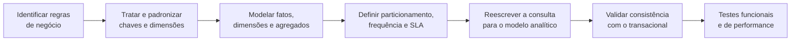
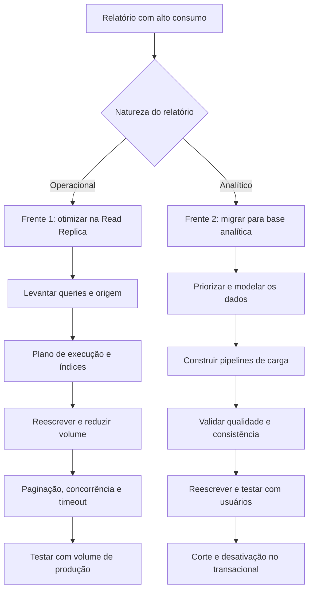

# Estudo de IOPS da Read Replica no Horário Comercial

> Análise do comportamento da **Read Replica** MySQL durante o horário comercial (06:00 às 19:00), cruzando CPU, carga do banco, IOPS, throughput, Top SQL, Top users e Top hosts para orientar otimizações e a migração de relatórios analíticos.

> [!NOTE]
> Nomes de empresa, instância, tabelas, colunas e usuários são fictícios, e os IPs estão mascarados. Usuários de aplicação aparecem como `application-user1`, `application-user2` etc., e usuários de pessoas como `pessoal-user1`, `pessoal-user2` etc. O único nome real é `adam.rodrigues`, autor desta documentação. Os gráficos foram redesenhados a partir das capturas originais e mantêm os valores e o formato observados.

---

## Sumário

1. [Objetivo](#1-objetivo)
2. [Escopo da análise](#2-escopo-da-análise)
3. [Agregação e média nos gráficos](#3-agregação-e-média-nos-gráficos)
4. [Resumo executivo](#4-resumo-executivo)
5. [Utilização de CPU](#5-utilização-de-cpu)
6. [Carga do banco](#6-carga-do-banco)
7. [Operações de I/O](#7-operações-de-io)
8. [Throughput de I/O](#8-throughput-de-io)
9. [Throughput de rede](#9-throughput-de-rede)
10. [Top SQL](#10-top-sql)
11. [Top users](#11-top-users)
12. [Top hosts](#12-top-hosts)
13. [Relatórios que devem permanecer no MySQL](#13-relatórios-que-devem-permanecer-no-mysql)
14. [Relatórios que devem ir para uma base analítica](#14-relatórios-que-devem-ir-para-uma-base-analítica)
15. [Direcionamento para correção](#15-direcionamento-para-correção)
16. [Capacidade média versus risco de pico](#16-capacidade-média-versus-risco-de-pico)
17. [Aumento de recursos](#17-aumento-de-recursos)
18. [Plano de ação](#18-plano-de-ação)
19. [Critérios de decisão do destino do relatório](#19-critérios-de-decisão-do-destino-do-relatório)
20. [Conclusão](#20-conclusão)

---

## 1. Objetivo

Analisar o comportamento da instância **Read Replica** durante o horário comercial, entre **06:00 e 19:00**, usando o dia **21/07/2026** como exemplo. Os valores variam entre os dias, mas o padrão observado costuma ser semelhante.

Diferente da **Primary**, a Read Replica não tem necessariamente um único horário de pico recorrente, como ocorre por volta das 12:00 na instância transacional principal. O impacto na réplica aparece principalmente quando:

- relatórios mal otimizados são executados;
- relatórios analíticos são processados diretamente no banco transacional;
- muitos clientes solicitam relatórios ao mesmo tempo;
- o volume de dados consultado é elevado;
- queries fazem leituras extensas, agregações, ordenações ou criam estruturas temporárias;
- ocorrem períodos de fechamento de folha.

Há uma concentração maior de extrações entre **08:00 e 11:00**, além de dias específicos do mês em que os clientes precisam de relatórios para conferência, fechamento de folha e análises operacionais.

---

## 2. Escopo da análise

| Item | Informação |
|------|------------|
| Instância | `empresa1-primary-8-read` |
| Engine | MySQL Community 8.4.5 |
| Classe | `db.m8g.8xlarge` |
| Tipo | Read Replica |
| Capacidade no Performance Insights | 32 vCPUs |
| IOPS provisionados | 25.000 IOPS |
| Data de exemplo | 21/07/2026 |
| Período analisado | 06:00 às 19:00 |
| Carga predominante | Relatórios, consultas e cargas de leitura |

**Evidências consideradas:** utilização de CPU, carga do banco em Average Active Sessions (AAS), operações de I/O, throughput de I/O, throughput de rede, Top SQL, Top users e Top hosts.

> [!NOTE]
> Os valores deste documento são aproximados e foram obtidos visualmente a partir dos gráficos.

---

## 3. Agregação e média nos gráficos

Em uma janela extensa como 06:00 às 19:00, o Performance Insights e o CloudWatch consolidam mais amostras em cada ponto do gráfico. Dependendo da métrica, da estatística e da granularidade, cada ponto pode representar a média de vários valores coletados, o que **dilui picos de curta duração**.

Por isso, os valores da visão de 13 horas podem não coincidir com:

- horários de alarmes registrados no Datadog;
- picos vistos em uma janela de poucos minutos;
- valores máximos observados durante um incidente;
- períodos curtos de saturação de CPU, IOPS ou throughput.

| Janela do gráfico | Uso recomendado |
|-------------------|-----------------|
| Longa (horas) | Avaliar o comportamento geral |
| Curta (minutos) | Investigar incidentes e confirmar o valor real do pico |

> [!TIP]
> Para investigar um alarme específico, filtre o Performance Insights e o CloudWatch no mesmo horário do alarme e use uma granularidade menor.

---

## 4. Resumo executivo

Durante a maior parte do horário comercial, a Read Replica opera abaixo da capacidade máxima da máquina, mas com utilização variável e diretamente ligada à execução de relatórios.

| Indicador | Observação |
|-----------|------------|
| CPU | Moderada na maior parte do período, com picos próximos de 40% a 45% |
| Carga do banco | Aumenta a partir das 08:00; atividade elevada e recorrente entre 08:00 e 11:00 |
| Pico de AAS | Cerca de **33 AAS** às 14:30, próximo ou acima da linha de 32 vCPUs |
| IOPS | Próximo do limite provisionado de **25.000 IOPS** |
| Throughput de I/O | Cerca de **414 MB/s** |
| Maior consumidor | Usuário `application-user1`, com cerca de **5,91 AAS** médio |
| Domínios das queries | Eventos/HCM, Atividades, Operações e relatórios analíticos |
| Estado predominante | `executing` |

A réplica não permanece saturada o dia todo. Mesmo assim, relatórios inadequados ou executados em paralelo podem consumir rapidamente CPU, IOPS e throughput.

---

## 5. Utilização de CPU

Na maior parte do período a CPU ficou entre **10% e 30%**, com picos próximos de **40% a 45%** nos momentos de maior atividade.

  

### Interpretação

A CPU não ficou constantemente saturada, mas isso não significa que todas as cargas sejam adequadas. Um relatório pode gerar impacto significativo sem levar a CPU a 100%, principalmente quando também ocorre:

- alto volume de leitura em disco;
- espera por páginas que não estão em memória;
- criação de tabelas temporárias;
- ordenações extensas;
- leitura de grandes intervalos de dados;
- execução simultânea de vários relatórios;
- competição com o processo de replicação.

O risco aumenta quando vários relatórios pesados são solicitados no mesmo intervalo.

---

## 6. Carga do banco

A carga começa baixa no início da manhã e cresce de forma consistente a partir das **08:00**.

  

| Horário aproximado | Carga observada | Interpretação |
|--------------------|-----------------|---------------|
| 06:00 às 08:00 | 1 a 7 AAS | Baixa atividade |
| 08:00 às 11:00 | 8 a 20 AAS | Maior concentração de relatórios |
| 09:30 | 22 AAS | Pico de consultas |
| 11:30 | 22 AAS | Evento pontual |
| 14:30 | 33 AAS | Pico próximo ou acima das 32 vCPUs |
| 15:00 às 17:00 | 8 a 17 AAS | Atividade recorrente |
| 18:00 às 19:00 | 2 a 10 AAS | Redução gradual |

### Estados predominantes

A maior parte da carga ficou no estado `executing`. Também aparecem `statistics`, `starting`, `Opening tables`, `freeing items`, `preparing`, `optimizing`, `converting HEAP to ondisk`, `closing tables` e estados classificados como `Unknown`.

### Interpretação

O predomínio de `executing` indica que a carga está ligada ao processamento efetivo das consultas.

> [!WARNING]
> O estado `converting HEAP to ondisk` indica que estruturas temporárias mantidas em memória precisaram ir para disco. Isso costuma acontecer em consultas com grandes agregações, `GROUP BY`, `ORDER BY`, `DISTINCT`, joins extensos, resultados intermediários volumosos ou limites insuficientes para temporários em memória.

---

## 7. Operações de I/O

A instância tem **25.000 IOPS provisionados**. No período analisado, o volume de leitura e escrita chegou perto desse limite.

  

### Interpretação

A réplica não usa 25.000 IOPS o dia todo, mas em alguns períodos se aproxima da capacidade provisionada. Relatórios pesados ou simultâneos consomem rapidamente a margem disponível.

A proximidade do limite deve ser correlacionada com:

| Métricas de disco | Métricas de carga |
|-------------------|-------------------|
| Read Latency | Quantidade de queries simultâneas |
| Write Latency | Volume de linhas examinadas |
| Disk Queue Depth | Uso de tabelas temporárias em disco |
| Read Throughput | Replica Lag |

> [!NOTE]
> A réplica também escreve em disco para aplicar as alterações recebidas da Primary. Por isso o gráfico mostra Write IOPS mesmo em uma instância usada principalmente para leitura.

---

## 8. Throughput de I/O

O throughput de leitura e escrita atingiu cerca de **414 MB/s**.

  

### Interpretação

O gráfico acompanha o comportamento de IOPS, com os maiores volumes nos mesmos períodos de concentração de relatórios, especialmente no fim da manhã e à tarde.

Uma query pode não gerar um número muito alto de IOPS e ainda assim consumir muito throughput ao fazer leituras sequenciais de blocos maiores. Por isso a capacidade deve ser analisada considerando juntos: IOPS, throughput, latência, fila de disco, AAS, tempo de execução e volume de dados lido.

---

## 9. Throughput de rede

O throughput de rede atingiu cerca de **32,67 MB/s**.

  

### Interpretação

O maior pico de rede ocorreu pela manhã, período com mais solicitações de relatórios. Esse consumo pode estar ligado ao envio de grandes resultados para aplicações ou ferramentas de extração.

O impacto deve ser correlacionado com: quantidade de linhas retornadas, tamanho dos resultados, exportações para planilhas, relatórios sem paginação, repetição da mesma consulta e quantidade de usuários executando relatórios ao mesmo tempo.

---

## 10. Top SQL

O Top SQL reúne consultas dos domínios **Eventos/HCM**, **Atividades**, **Operações/HCM** e relatórios analíticos.

  

### Principais comandos observados

| Ordem | Comando resumido | AAS médio | Calls/s | Domínio |
|:-----:|------------------|:---------:|:-------:|---------|
| 1 | ``SELECT `evl`.`member_id`, `evl`.`event_date`, `evl`.`reference_date` ...`` | 0,75 | 0,01 | Eventos/HCM |
| 2 | ``SELECT `act`.`reference_date` AS `referenceDate`, `act`.`member_id` AS `memb...`` | 0,45 | 0,22 | Atividades |
| 3 | ``SELECT `evl`.`member_id` AS `member_id`, `au`.`name` AS `app_user_adjust`...`` | 0,31 | 0,00 | Eventos/HCM |
| 4 | ``SELECT `loc`.`id` AS `locationId` FROM `location` `loc` LEFT JOIN `partner` `pa...`` | 0,28 | 1,03 | Operações/HCM |
| 5 | ``SELECT `org`.`id` AS `org_id`, `org`.`org_name` AS `org_name`, `par`...`` | 0,28 | 0,00 | Operações/HCM |
| 6 | ``SELECT `mem`.`id`, `loc`.`id` AS `location_id`, `org`.`id` AS `organiz...`` | 0,26 | 0,51 | Operações/HCM |
| 7 | ``SELECT `mem`.`id` AS `memberId`, `mem`.`name` AS `memberName`, `mem`.`en...`` | 0,22 | 0,03 | Atividades |
| 8 | ``SELECT ? AS `NO_KILL_ON_TIMEOUT`, SUM(`tab1`.`metricValue`...`` | 0,21 | 0,00 | Analítico |
| 9 | ``SELECT `evl`.`member_id` FROM `event_log` `evl` INNER JOIN `member` `m` ON `m`...`` | 0,20 | 0,01 | Eventos/HCM |
| 10 | ``SELECT /*+ NO_JOIN_INDEX(`act` `PRIMARY`, `fk_activity_record_member...`` | 0,19 | 0,00 | Atividades |

### Interpretação

Os valores de AAS aparecem diluídos porque representam a média de uma janela de 13 horas. Uma query com poucas chamadas por segundo ainda pode ser muito agressora quando:

- tem longa duração;
- lê grande volume de dados;
- executa grandes agregações;
- não usa índices adequados;
- gera estruturas temporárias;
- é executada ao mesmo tempo por vários clientes;
- faz processamento analítico no banco transacional.

**Checklist de análise por query relevante**

| Execução | Volume | Origem |
|----------|--------|--------|
| Plano de execução | Linhas examinadas | Frequência |
| Índices utilizados | Linhas retornadas | Concorrência |
| Índices ausentes | Volume de leitura | Serviço de origem |
| Tempo médio e máximo | Uso de temporários | Relatório de origem |
| Ordenação em disco | | |

---

## 11. Top users

O usuário `application-user1` concentrou a maior carga média do período, com cerca de **5,91 AAS**.

  

| Usuário ou serviço | AAS médio |
|--------------------|:---------:|
| `application-user1` | 5,91 |
| `application-user2` | 1,07 |
| `application-user3` | 0,86 |
| `application-user4` | 0,71 |
| `application-user5` | 0,30 |
| `application-user6` | 0,19 |
| `application-user7` | 0,19 |
| `application-user8` | 0,02 |
| `application-user9` | 0,01 |
| Demais usuários | Menor que 0,01 |

### Interpretação

O usuário `application-user1` deve ser a prioridade inicial do levantamento. Também devem ser investigados:

- relatórios executados pelo `application-user3`;
- consultas originadas pelo `application-user2`;
- cargas do `application-user4`;
- consultas de folha no usuário `application-user5`;
- relatórios de `application-user6` e `application-user7`.

### Acesso de usuários pessoais

A captura também mostra usuários pessoais conectados à réplica, usados para suporte e diagnóstico. Esse acesso deve ficar restrito a quem precisa acompanhar queries em execução, apoiar incidentes, analisar planos de execução, fazer troubleshooting, validar relatórios ou investigar performance.

| Regra para acessos pessoais |
|-----------------------------|
| Permissão somente de leitura |
| Uso individual e não compartilhado |
| Auditoria habilitada |
| Revisão periódica |
| Remoção quando não houver mais necessidade |
| Não usar a réplica como ferramenta permanente de consulta manual sem controle |

---

## 12. Top hosts

A carga aparece distribuída entre vários hosts.

  

| Host | AAS médio |
|------|:---------:|
| `10.194.9999.9999` | 1,33 |
| `10.194.9999.9999` | 1,08 |
| `10.194.9999.9999` | 0,93 |
| `10.194.9999.9999` | 0,85 |
| `10.194.9999.9999` | 0,44 |
| `10.194.9999.9999` | 0,38 |
| `10.194.9999.9999` | 0,36 |

### Interpretação

A distribuição entre vários IPs indica que a carga pode vir de múltiplas instâncias de aplicação, ferramentas de relatório ou pods. Cada IP deve ser mapeado para:

| Técnico | Negócio |
|---------|---------|
| Serviço | Tipo de relatório |
| Deployment | Usuário do banco |
| Pod | Time responsável |
| Ferramenta | Ambiente |

Esse mapeamento permite relacionar o consumo do banco com o processo real que iniciou a consulta.

---

## 13. Relatórios que devem permanecer no MySQL

Nem todo relatório precisa sair do MySQL. Relatórios operacionais de baixo custo podem continuar na Read Replica quando têm:

- filtros seletivos e índices adequados;
- pequeno intervalo de datas e baixo volume de dados;
- paginação;
- tempo de execução previsível;
- concorrência controlada;
- necessidade de dados quase em tempo real.

Esses relatórios devem ser reavaliados e otimizados quando necessário:

| Consulta | Execução |
|----------|----------|
| Reescrever queries | Implementar paginação |
| Criar ou ajustar índices | Evitar consultas repetitivas |
| Remover joins desnecessários | Controlar execuções simultâneas |
| Reduzir colunas retornadas | Limitar intervalos de datas |
| Aplicar filtros antes dos joins | Revisar agregações e subqueries correlacionadas |

---

## 14. Relatórios que devem ir para uma base analítica

Alguns relatórios não serão bem atendidos pelo MySQL transacional, mesmo otimizados. Devem ir para uma **base analítica** quando têm:

- grandes intervalos históricos ou leitura de milhões de registros;
- agregações complexas, muitos joins ou cruzamento de vários domínios;
- ordenações extensas e alto uso de temporários;
- execução demorada ou muitos usuários simultâneos;
- finalidade gerencial ou analítica;
- exportação de grandes volumes.

A migração não é apenas copiar a query atual:

---

## 15. Direcionamento para correção

A atuação é dividida em duas frentes:

### 15.1 Otimização dos relatórios operacionais

1. Levantar as queries mais agressoras.
2. Identificar o relatório e o serviço de origem.
3. Analisar o plano de execução e revisar índices.
4. Reescrever consultas quando necessário.
5. Reduzir o volume processado e implementar paginação.
6. Controlar concorrência e definir timeout.
7. Testar com volume semelhante ao de produção.

### 15.2 Migração dos relatórios analíticos

1. Priorizar a migração para a plataforma analítica.
2. Modelar os dados.
3. Construir pipelines de carga.
4. Validar qualidade e consistência.
5. Reescrever os relatórios e testar com os usuários.
6. Definir estratégia de corte.
7. Desativar a versão transacional após validação.

---

## 16. Capacidade média versus risco de pico

A Read Replica não fica no limite durante todo o horário comercial, mas isso não elimina o risco. A média pode parecer confortável enquanto um único relatório inadequado:

| Recurso | Efeito possível |
|---------|-----------------|
| Disco | Atinge o limite de IOPS, eleva o throughput, aumenta latência e fila |
| CPU | Consome processamento e alonga outras consultas |
| Replicação | Aumenta o Replica Lag |
| Clientes | Timeout nas extrações e impacto em quem roda relatórios ao mesmo tempo |

**Maior risco em:** 08:00 às 11:00, dias de fechamento de folha, fechamento mensal, execuções simultâneas, relatórios com grandes intervalos e consultas analíticas no transacional.

---

## 17. Aumento de recursos

> [!IMPORTANT]
> Aumentar CPU, memória, IOPS ou throughput **não corrige a causa** dos problemas. Sem correção, a carga tende a consumir de novo a capacidade adicionada.

| O aumento não corrige | O aumento oferece |
|-----------------------|-------------------|
| Queries mal otimizadas | Menor risco imediato de saturação |
| Ausência de índices | Mais tolerância a relatórios simultâneos |
| Leitura excessiva de dados | Menor chance de indisponibilidade |
| Relatórios analíticos no transacional | Tempo para os times de Engenharia atuarem |
| Alto uso de temporários | Refatoração com menor risco |
| Ausência de paginação | Margem durante a migração para a base analítica |
| Execuções simultâneas sem controle | |
| Problemas de modelagem | |
| Falta de plataforma analítica adequada | |

---

## 18. Plano de ação

| Prioridade | Ação | Responsável | Objetivo |
|------------|------|-------------|----------|
| **Crítica** | Levantar relatórios e queries com maior consumo | DBA | Identificar as principais causas |
| **Crítica** | Mapear o usuário `application-user1` para serviços e relatórios | Engenharia e DBA | Identificar a origem da maior carga |
| **Crítica** | Identificar relatórios analíticos executados no MySQL | Engenharia e Dados | Definir o que deve ser migrado |
| **Alta** | Revisar planos de execução e índices | DBA e Engenharia | Reduzir leitura e tempo de execução |
| **Alta** | Refatorar queries operacionais | Engenharia | Melhorar os relatórios que ficam no MySQL |
| **Alta** | Criar backlog de migração para a base analítica | Engenharia de Dados | Retirar cargas inadequadas do transacional |
| **Alta** | Mapear hosts para serviços e pods | Plataforma e Engenharia | Identificar a origem técnica das consultas |
| **Média** | Revisar acessos pessoais à réplica | DBA e Segurança | Manter apenas acessos necessários |
| **Média** | Criar limites de concorrência e timeout | Engenharia | Evitar saturação por simultaneidade |
| **Média** | Manter alertas de CPU, IOPS, throughput e latência | DBA e Observabilidade | Detectar risco antecipadamente |
| **Média** | Avaliar aumento temporário de capacidade | DBA e Infraestrutura | Criar margem até concluir as correções |

---

## 19. Critérios de decisão do destino do relatório

| Característica | Read Replica MySQL | Base analítica |
|----------------|--------------------|----------------|
| Consulta operacional simples | Adequado | Opcional |
| Dados quase em tempo real | Adequado | Depende do SLA |
| Pequeno intervalo de datas | Adequado | Adequado |
| Paginação e baixo volume | Adequado | Adequado |
| Histórico extenso | Não recomendado | Recomendado |
| Milhões de registros | Não recomendado | Recomendado |
| Agregações complexas | Avaliar | Recomendado |
| Muitos joins | Avaliar | Recomendado |
| Exportações de grande volume | Não recomendado | Recomendado |
| Relatórios gerenciais | Não recomendado | Recomendado |
| Alta concorrência | Risco elevado | Recomendado |
| Processamento analítico | Não recomendado | Recomendado |

---

## 20. Conclusão

- A Read Replica tem comportamento diferente da Primary: não há um horário fixo de pico, e os problemas surgem quando relatórios mal otimizados, pesados ou analíticos rodam no banco transacional.
- A utilização cresce com mais frequência entre **08:00 e 11:00** e em dias de fechamento de folha ou fechamento mensal.
- Os gráficos de 06:00 às 19:00 são agregados; por isso os números podem não coincidir com os alarmes do Datadog sem filtrar o horário específico.
- A **primeira frente** é otimizar os relatórios que precisam ficar no MySQL: reescrita de queries, revisão de índices, paginação e controle de concorrência.
- A **segunda frente** é identificar os relatórios de natureza analítica e migrá-los para uma base preparada para esse tipo de processamento.
- Aumentar CPU, memória, IOPS ou throughput só dá margem temporária até que as refatorações sejam concluídas e os relatórios pesados sejam migrados.
