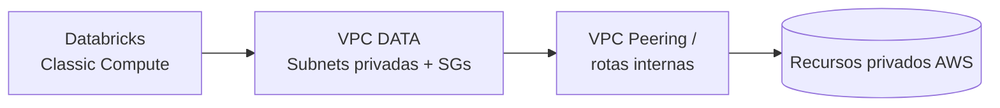
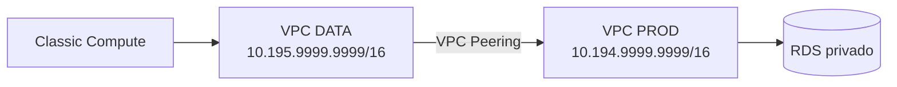
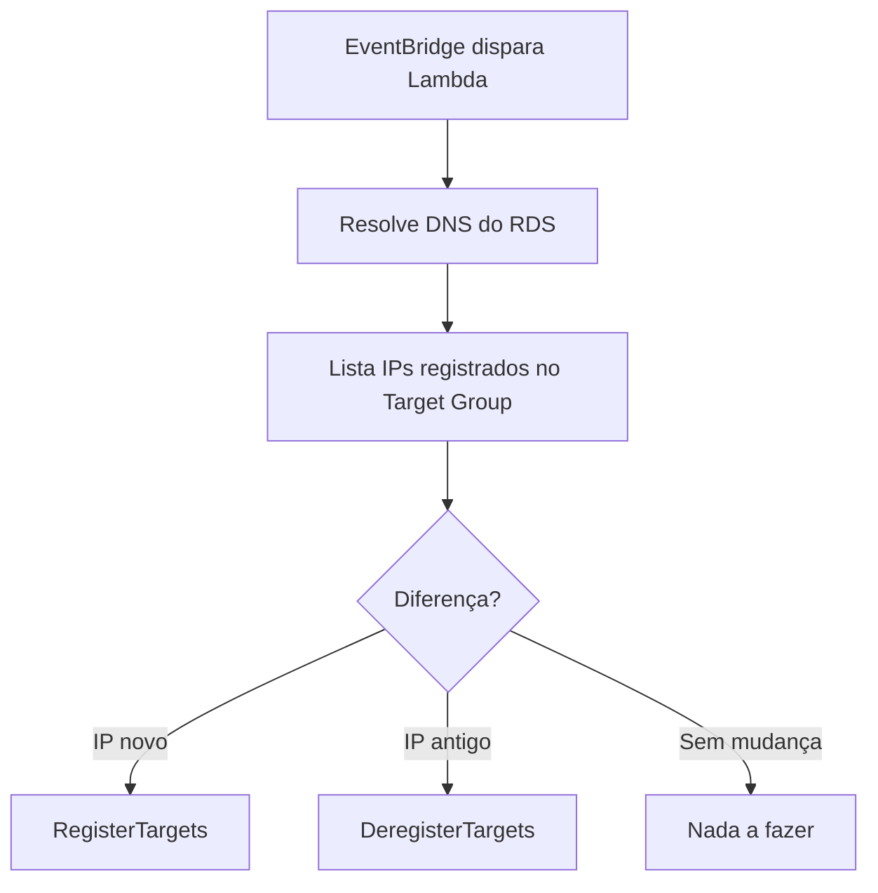
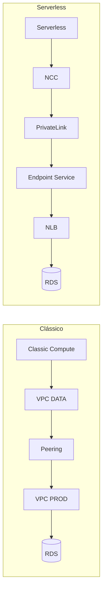

# Databricks na AWS: Compute Clássico e Serverless com PrivateLink para RDS


> Documentação da infraestrutura de um ambiente **Databricks na AWS**, cobrindo o compute clássico dentro da VPC da conta de dados e a conectividade privada do **Databricks Serverless** com um **RDS MySQL privado** via **NCC + AWS PrivateLink + NLB**.

> [!NOTE]
> Nomes de empresa, repositórios, IDs de conta, VPCs, endpoints e ARNs foram substituídos por valores fictícios.

---

## Sumário

1. [Objetivo](#1-objetivo)
2. [Repositórios](#2-repositórios)
3. [Compute clássico na AWS](#3-compute-clássico-na-aws)
4. [Serverless: contexto e desafios](#4-serverless-contexto-e-desafios)
5. [Arquitetura Serverless implementada](#5-arquitetura-serverless-implementada)
6. [RDS utilizado](#6-rds-utilizado)
7. [Módulo `serverless-rds-privatelink`](#7-módulo-serverless-rds-privatelink)
8. [Lambda de sincronização de IP](#8-lambda-de-sincronização-de-ip)
9. [Instanciação no ambiente DATA](#9-instanciação-no-ambiente-data)
10. [Validações](#10-validações)
11. [Clássico vs. Serverless](#11-clássico-vs-serverless)
12. [Pontos de atenção](#12-pontos-de-atenção)
13. [Resultado final](#13-resultado-final)

---

## 1. Objetivo

Esta documentação descreve dois cenários principais:

| Cenário | Descrição |
|---------|-----------|
| **Compute clássico** | Databricks rodando dentro da VPC da conta AWS DATA |
| **Serverless** | Databricks Serverless acessando RDS privado via NCC + PrivateLink + NLB |

A **primeira parte** cobre a base: IAM, workspaces, storage, metastore, Unity Catalog e compute clássico.
A **segunda parte** cobre a conectividade privada para que workloads Serverless acessem o RDS **sem exposição pública**.

---

## 2. Repositórios

| Repositório | Responsabilidade |
|-------------|------------------|
| `infra-iam` | Roles e policies IAM usadas pelo Databricks |
| `infra-commons` | Módulos Terraform e infraestrutura da conta DATA + recursos Databricks |

### 2.1 `infra-iam`

```text
infra-iam/
└── iam/
    ├── outros-arquivos.tf
    ├── databricks-cross-account.tf
    ├── databricks-metastore-access.tf
    └── databricks-serverless-rds-ip-sync.tf
```

<details>
<summary><b>databricks-cross-account.tf</b></summary>

Role **cross-account** usada pelo Databricks para criar e gerenciar recursos na AWS. Utilizada principalmente na criação dos workspaces via Account Console, API ou Terraform.

</details>

<details>
<summary><b>databricks-metastore-access.tf</b></summary>

Role/policy usada pelo **Unity Catalog** para ler e gravar dados gerenciados no storage root do metastore.

| Item | Valor |
|------|-------|
| Bucket | `empresa1-data-databricks-metastore` |
| Role | `empresa1-data-databricks-metastore-access-role` |

</details>

<details>
<summary><b>databricks-serverless-rds-ip-sync.tf</b></summary>

Permite que uma Lambda mantenha atualizado o Target Group usado pelo PrivateLink Serverless.

| Item | Valor |
|------|-------|
| Role | `empresa1-data-databricks-serverless-rds-ip-sync-role` |
| Policy | `empresa1-data-databricks-serverless-rds-ip-sync-policy` |
| Policy gerenciada | `AWSLambdaVPCAccessExecutionRole` |

**Permissões:**

```text
elasticloadbalancing:DescribeTargetHealth
elasticloadbalancing:RegisterTargets
elasticloadbalancing:DeregisterTargets
logs:CreateLogGroup
logs:CreateLogStream
logs:PutLogEvents
```

A policy `AWSLambdaVPCAccessExecutionRole` permite que a Lambda rode dentro da VPC e crie interfaces de rede nas subnets privadas.

</details>

### 2.2 `infra-commons`

```text
infra-commons/
├── modules/
│   └── databricks/
│       ├── aws-workspace/
│       │   ├── main.tf
│       │   ├── variables.tf
│       │   └── outputs.tf
│       │
│       └── serverless-rds-privatelink/
│           ├── main.tf
│           ├── variables.tf
│           ├── outputs.tf
│           ├── versions.tf
│           └── lambda/
│               └── ip_sync.py
│
└── provider/
    └── aws/
        └── environments/
            └── data/
                ├── outros-arquivos.tf
                ├── databricks.tf
                ├── databricks-metastore.tf
                └── databricks-serverless-rds-privatelink.tf
```

---

## 3. Compute clássico na AWS

### 3.1 Visão geral

No modelo clássico, os clusters Databricks rodam **dentro da VPC da conta AWS DATA**, podendo acessar recursos privados (como RDS) desde que existam rotas, security groups e NACLs adequados.



### 3.2 Componentes provisionados

- Databricks Account Provider
- Workspaces Databricks `dev` e `prod`
- Cross-account IAM role
- Storage root dos workspaces
- Bucket do metastore Unity Catalog + role de acesso
- Network configuration dos workspaces
- Security Groups e subnets privadas
- Unity Catalog Metastore e associação aos workspaces

### 3.3 Workspaces

Foram criados os workspaces **`dev`** e **`prod`**, cada um com:

- `workspace_id` e `workspace_url`
- storage configuration
- network configuration
- credentials configuration

### 3.4 Unity Catalog

| Item | Valor |
|------|-------|
| Região | `us-east-1` |
| Storage root | `s3://empresa1-data-databricks-metastore/metastore` |
| Role de acesso | `arn:aws:iam::259999999999:role/empresa1-data-databricks-metastore-access-role` |

### 3.5 Rede do compute clássico

| Item | Valor |
|------|-------|
| VPC DATA | `vpc-0daaaaaaaaaaaaaaa` |
| CIDR | `10.195.9999.9999/16` |

Como o tráfego sai pela própria VPC DATA, o acesso privado funciona apenas com **rotas, VPC peering e regras de Security Group**:



---

## 4. Serverless: contexto e desafios

### 4.1 O problema

O compute **Serverless não usa a VPC DATA**. Durante os testes, ele apresentava IP interno fora da VPC e sem rota para o RDS privado:

| Origem / Destino | IP |
|------------------|----|
| Serverless (IP interno) | `192.168.9999.9999` |
| RDS privado | `10.194.9999.9999` |

```text
Erro: No route to host
```

O Serverless tentava acessar diretamente o IP privado do RDS, sem nenhuma rota até a VPC PROD.

### 4.2 Necessidade do tier Enterprise

A criação do recurso `databricks_mws_ncc_private_endpoint_rule` falhou com:

```text
Account does not have one of required pricing tier(s) ENTERPRISE, DEDICATED, OEM_CORE.
```

> [!IMPORTANT]
> A **Network Connectivity Configuration (NCC)** com **Private Endpoint Rule** é necessária para que workloads Serverless acessem recursos privados via PrivateLink, e exige o tier **Enterprise**. Após o upgrade da conta, foi possível criar a NCC e a regra privada.

---

## 5. Arquitetura Serverless implementada

### 5.1 Fluxo final

```mermaid
flowchart LR
    subgraph DBX[Databricks (plano gerenciado)]
        A[Serverless Compute] --> B[NCC]
        B --> C[Private Endpoint Rule]
    end

    C -->|AWS PrivateLink| D

    subgraph DATA[AWS (VPC DATA)]
        D[VPC Endpoint Service] --> E[NLB interno]
        E --> F[Target Group<br/>TCP / tipo IP]
        L[Lambda ip-sync] -.atualiza IPs.-> F
        EB[EventBridge] -.agenda.-> L
    end

    F -->|TCP 3306| G

    subgraph PROD[AWS (VPC PROD)]
        G[(RDS MySQL privado)]
    end
```

### 5.2 Componentes

| Lado AWS | Lado Databricks |
|----------|-----------------|
| Network Load Balancer interno | Network Connectivity Configuration (NCC) |
| Target Group do tipo IP | NCC Private Endpoint Rule |
| Listener TCP `3306` | NCC Binding com workspaces `dev`/`prod` |
| VPC Endpoint Service | |
| Lambda de sync do IP do RDS | |
| EventBridge Rule (execução periódica) | |
| CloudWatch Log Group | |
| Security Group da Lambda | |

A Private Endpoint Rule aponta para o **endpoint DNS real do RDS**:

```text
empresa1-read-analytics.cjaaaaaaaaaa.us-east-1.rds.amazonaws.com
```

---

## 6. RDS utilizado

| Item | Valor |
|------|-------|
| Endpoint | `empresa1-read-analytics.cjaaaaaaaaaa.us-east-1.rds.amazonaws.com` |
| Porta | `3306` |
| IP resolvido (na configuração) | `10.194.9999.9999` |
| VPC | `vpc-01aaaaaaaaaaaaaaa` |
| CIDR VPC PROD | `10.194.9999.9999/16` |

---

## 7. Módulo `serverless-rds-privatelink`

Cria a camada AWS necessária para expor o RDS privado ao Databricks Serverless via PrivateLink.

**Localização:** `infra-commons/modules/databricks/serverless-rds-privatelink/`

| Recurso Terraform | Finalidade |
|-------------------|------------|
| `aws_lb` | NLB interno |
| `aws_lb_target_group` | Target Group TCP do tipo IP |
| `aws_lb_listener` | Listener TCP 3306 |
| `aws_vpc_endpoint_service` | Serviço exposto via PrivateLink |
| `aws_lambda_function` | Sync do IP do RDS |
| `aws_cloudwatch_event_rule` | Agendamento da Lambda |
| `aws_cloudwatch_event_target` | Alvo do agendamento |
| `aws_lambda_permission` | Permite o EventBridge invocar a Lambda |
| `aws_cloudwatch_log_group` | Logs da Lambda |
| `aws_security_group` | SG da Lambda |

---

## 8. Lambda de sincronização de IP

### 8.1 Por que existe

O RDS expõe um **endpoint DNS**, sem IP fixo garantido, enquanto o Target Group do NLB (tipo `ip`) exige **IPs registrados**.

```text
RDS endpoint      -> DNS
NLB Target Group  -> IP
```

**Solução:** uma Lambda resolve o DNS do RDS periodicamente e mantém o Target Group sincronizado.

### 8.2 Funcionamento



### 8.3 Ajustes realizados

#### Permissão `DescribeTargetHealth`

```text
AccessDenied - elasticloadbalancing:DescribeTargetHealth
```

**Correção:** separar `DescribeTargetHealth` em um statement próprio com `Resource = "*"`, mantendo `RegisterTargets` e `DeregisterTargets` restritos ao prefixo `tg-dbx-sl-rds-`.

```hcl
{
  Effect   = "Allow"
  Action   = ["elasticloadbalancing:DescribeTargetHealth"]
  Resource = "*"
}
```

#### Availability Zone para IP fora da VPC

O Target Group está na VPC DATA e o IP do RDS está na VPC PROD, então a AWS exige informar a AZ:

```text
The Availability Zone is required for IP address '10.194.9999.9999' because it is not in the VPC
```

**Correção** no `ip_sync.py`:

```python
AvailabilityZone = "all"
```

---

## 9. Instanciação no ambiente DATA

**Arquivo:** `infra-commons/provider/aws/environments/data/databricks-serverless-rds-privatelink.tf`

Instancia o módulo de PrivateLink e cria os recursos NCC no Databricks:

- [x] Define endpoint do RDS e porta `3306`
- [x] Referencia VPC DATA e subnets privadas
- [x] Referencia a IAM Role da Lambda
- [x] Cria o VPC Endpoint Service
- [x] Cria a NCC no Databricks
- [x] Cria a Private Endpoint Rule
- [x] Associa a NCC aos workspaces `dev`/`prod`

---

## 10. Validações

### 10.1 Aceite do VPC Endpoint

Após a criação da Private Endpoint Rule, o Databricks cria um VPC Endpoint consumidor, que aparece como `pendingAcceptance`. Aceite manual:

```bash
aws ec2 accept-vpc-endpoint-connections \
  --service-id vpce-svc-06aaaaaaaaaaaaaaa \
  --vpc-endpoint-ids vpce-09aaaaaaaaaaaaaaa \
  --profile empresa1-data-terraform \
  --region us-east-1
```

```json
{
  "Unsuccessful": []
}
```

### 10.2 Execução da Lambda

```bash
aws lambda invoke \
  --function-name ip-sync-dbx-sl-rds-read-analytics \
  --profile empresa1-data-terraform \
  --region us-east-1 \
  /tmp/ip-sync-output.json

cat /tmp/ip-sync-output.json
```

```json
{
  "status": "ok",
  "resolved_ips": ["10.194.9999.9999"],
  "registered_ips_before": ["10.194.9999.9999"],
  "registered": [],
  "deregistered": [],
  "target_availability_zone": "all"
}
```

A Lambda resolveu o endpoint e confirmou que o IP já estava registrado.

### 10.3 Saúde do Target Group

```bash
aws elbv2 describe-target-health \
  --target-group-arn arn:aws:elasticloadbalancing:us-east-1:259999999999:targetgroup/tg-dbx-sl-rds-read-analytics/d7aaaaaaaaaaaaaa \
  --profile empresa1-data-terraform \
  --region us-east-1 \
  --output json
```

```json
{
  "Target": {
    "Id": "10.194.9999.9999",
    "Port": 3306,
    "AvailabilityZone": "all"
  },
  "TargetHealth": {
    "State": "healthy"
  }
}
```

O NLB consegue encaminhar tráfego para o RDS na porta `3306`.

### 10.4 DNS no Databricks Serverless

| Momento | Resolução do endpoint do RDS |
|---------|------------------------------|
| **Antes** | `10.194.9999.9999` (IP direto do RDS, sem rota) |
| **Depois** | `172.18.9999.9999` (5 IPs privados da conectividade PrivateLink) |

O domínio do RDS passou a ser interceptado pela regra privada do Serverless.

---

## 11. Clássico vs. Serverless

| Característica | Compute Clássico | Serverless |
|----------------|------------------|------------|
| Onde roda | Dentro da VPC DATA | Infra gerenciada pela Databricks |
| Rota até o RDS | Via peering + rotas | Não possui rota direta |
| Controle de acesso | Security Groups / NACLs | NCC + PrivateLink |
| Precisa de NCC/PrivateLink? | Não | Sim |
| Tier Databricks exigido | Padrão | Enterprise |



---

## 12. Pontos de atenção

> [!WARNING]
> **Tier da conta Databricks:** a NCC Private Endpoint Rule exige tier **Enterprise** (ou Dedicated/OEM Core). Sem ele, o Terraform falha ao criar `databricks_mws_ncc_private_endpoint_rule`.

> [!WARNING]
> **Campo `enabled`:** o atributo `enabled = true` não é suportado para esse tipo de endpoint service:
> ```text
> Field enabled is not supported for endpoint service
> ```
> **Correção:** remover `enabled = true` do recurso `databricks_mws_ncc_private_endpoint_rule`.

> [!TIP]
> **Lambda em subnet privada:** a Lambda precisa alcançar as APIs do ELBv2 (`DescribeTargetHealth`, `RegisterTargets`, `DeregisterTargets`). Garanta **NAT Gateway** ou **VPC Endpoint** para o serviço `elasticloadbalancing` nas subnets usadas.

---

## 13. Resultado final

O Databricks Serverless passou a acessar o RDS privado **sem nenhuma exposição pública**.

| Validação | Status |
|-----------|:------:|
| VPC Endpoint aceito | OK |
| DNS Serverless resolvendo para IPs do PrivateLink | OK |
| Lambda executando com sucesso | OK |
| IP do RDS registrado no Target Group | OK |
| Target Group `healthy` | OK |
| NLB alcançando RDS na porta `3306` | OK |

A conectividade privada entre **Databricks Serverless** e **RDS** foi implementada e validada em nível de rede.
