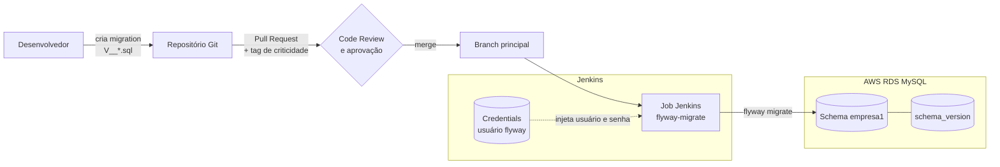
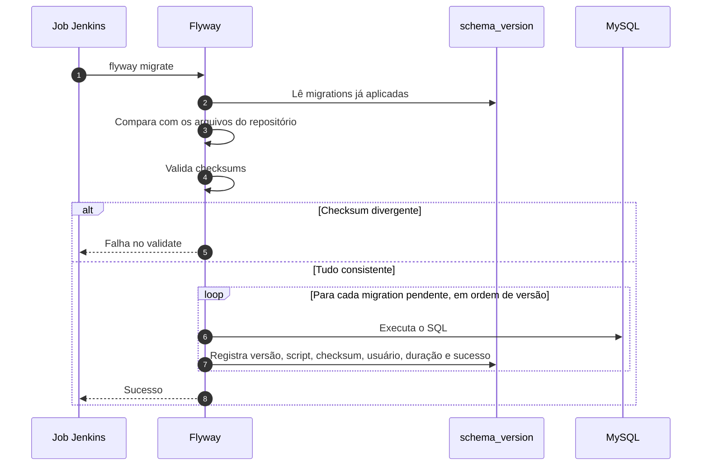
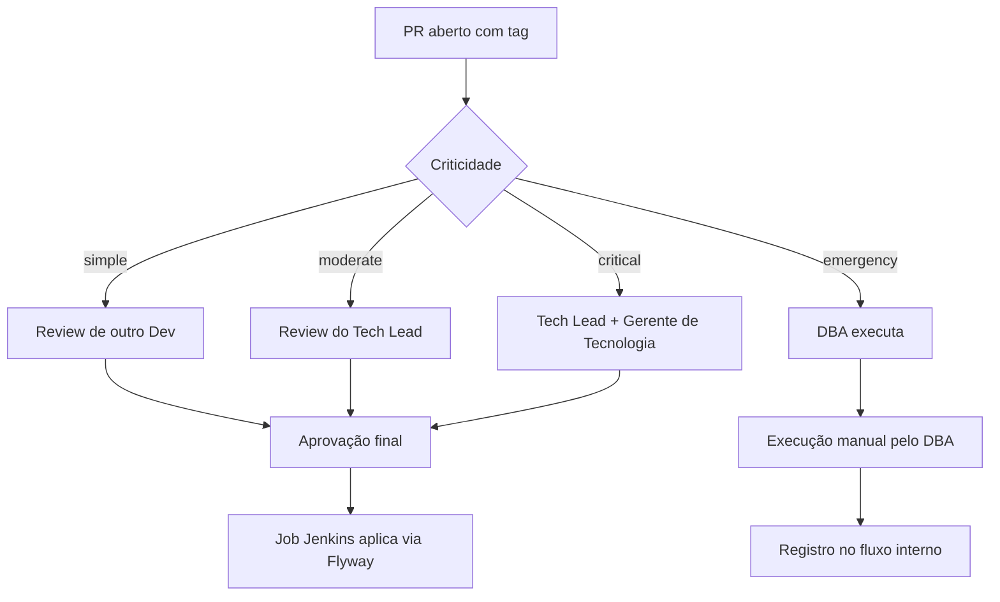

# Flyway: Padrões e Boas Práticas para Migrations MySQL


> Guia para padronizar o uso do **Flyway** em bancos **MySQL**, com foco em rastreabilidade, controle, validação por criticidade e segurança nas mudanças de schema e dados.

> [!NOTE]
> Nomes de empresa, schemas, tabelas e colunas foram substituídos por valores fictícios.

---

## Sumário

1. [Objetivo](#1-objetivo)
2. [Motivação](#2-motivação)
3. [Arquitetura](#3-arquitetura)
4. [Criticidade das migrations](#4-criticidade-das-migrations)
5. [Responsáveis e papéis](#5-responsáveis-e-papéis)
6. [Boas práticas](#6-boas-práticas)
7. [Identificação de locks](#7-identificação-de-locks)
8. [Tabelas com mais locks](#8-tabelas-com-mais-locks)

---

## 1. Objetivo

Padronizar o uso do Flyway e recomendar boas práticas em bancos MySQL, garantindo:

- **Rastreabilidade** de toda mudança aplicada
- **Controle** sobre o que é executado e por quem
- **Validação** proporcional à criticidade de cada mudança
- **Segurança** nas alterações de schema e de dados

Os times têm liberdade para criar documentos complementares ou sugerir melhorias neste guia.

> [!IMPORTANT]
> Atualmente o Flyway é mais utilizado pelo time de **Desenvolvimento** do que pelo time de **Foundation/Dados**. Por enquanto, as aprovações de Pull Requests são feitas pelos responsáveis listados neste documento, mas a intenção é que cada **Tech Lead** passe a aprovar as demandas do próprio time.

---

## 2. Motivação

- Documentar e estruturar os tipos de migration: **simples, moderadas, críticas e emergenciais**
- Garantir que toda modificação no banco esteja registrada e rastreável
- Evitar perda de histórico e inconsistências entre ambientes
- Definir papéis e responsáveis no fluxo de aprovação e execução
- Reduzir **locks** nas bases de produção

---

## 3. Arquitetura

### 3.1 Visão geral

As migrations vivem no repositório da aplicação, passam por Pull Request com revisão e são aplicadas no banco por um **job do Jenkins**, que executa o Flyway com um **usuário dedicado** cujas credenciais ficam guardadas no **Jenkins Credentials**.



### 3.2 Componentes

| Componente | Função |
|------------|--------|
| **Repositório Git** | Armazena os arquivos de migration versionados (`V<versão>__<descrição>.sql`) |
| **Pull Request** | Ponto de revisão e aprovação, com tag de criticidade no título |
| **Job Jenkins** | Executa `info`, `validate` e `migrate` do Flyway contra o banco alvo |
| **Jenkins Credentials** | Guarda usuário e senha do Flyway; nunca ficam no código |
| **Usuário `flyway`** | Usuário MySQL dedicado, com apenas as permissões necessárias para migrations |
| **Tabela `schema_version`** | Histórico de controle do Flyway: o que foi aplicado, quando, por quem e com qual checksum |

### 3.3 Como o Flyway executa uma migration



### 3.4 Tabela de controle `schema_version`

O Flyway mantém uma tabela de histórico no schema alvo. Neste ambiente ela se chama `schema_version`, definida pela configuração:

```properties
flyway.table=schema_version
```

| Coluna | Conteúdo |
|--------|----------|
| `installed_rank` | Ordem em que a migration foi aplicada |
| `version` | Versão extraída do nome do arquivo |
| `description` | Descrição extraída do nome do arquivo |
| `type` | Tipo da migration (`SQL`, `JDBC` etc.) |
| `script` | Nome do arquivo executado |
| `checksum` | Hash do conteúdo, usado para detectar alterações em arquivos já aplicados |
| `installed_by` | Usuário do banco que executou |
| `installed_on` | Data e hora da execução |
| `execution_time` | Duração em milissegundos |
| `success` | `1` para sucesso, `0` para falha |

> [!WARNING]
> Nunca edite um arquivo de migration que já foi aplicado. O checksum muda e o `validate` falha. Para corrigir, crie uma nova migration.

Consulta útil para acompanhar o histórico:

```sql
SELECT installed_rank, version, description, script, installed_by, installed_on, execution_time, success
FROM empresa1.schema_version
ORDER BY installed_rank DESC
LIMIT 20;
```

### 3.5 Usuário do Flyway

O Flyway usa um usuário MySQL exclusivo, separado dos usuários da aplicação e dos usuários pessoais. Isso permite identificar suas sessões no `PROCESSLIST` e encerrá-las com segurança quando necessário (ver [Identificação de locks](#7-identificação-de-locks)).

```sql
CREATE USER 'flyway'@'%' IDENTIFIED BY '<senha-forte>';
```

```sql
GRANT SELECT, INSERT, UPDATE, DELETE,
      CREATE, ALTER, DROP, INDEX, REFERENCES,
      CREATE VIEW, SHOW VIEW,
      CREATE ROUTINE, ALTER ROUTINE, EXECUTE,
      TRIGGER, LOCK TABLES
ON empresa1.* TO 'flyway'@'%';
```

| Permissão | Para que serve |
|-----------|----------------|
| `SELECT`, `INSERT`, `UPDATE`, `DELETE` | Migrations DML e escrita na `schema_version` |
| `CREATE`, `ALTER`, `DROP` | Criar, alterar e remover tabelas |
| `INDEX`, `REFERENCES` | Criar índices e foreign keys |
| `CREATE VIEW`, `SHOW VIEW` | Gerenciar views |
| `CREATE ROUTINE`, `ALTER ROUTINE`, `EXECUTE` | Gerenciar procedures e functions |
| `TRIGGER` | Gerenciar triggers |
| `LOCK TABLES` | Bloqueio usado pelo Flyway durante a execução |

> [!TIP]
> O usuário tem acesso somente ao schema `empresa1`. Ele não recebe `SUPER`, `GRANT OPTION` nem permissões globais.

### 3.6 Credenciais no Jenkins

Usuário e senha ficam cadastrados no **Jenkins Credentials** como `Username with password`, um por ambiente:

| Credential ID | Ambiente |
|---------------|----------|
| `flyway-mysql-empresa1-dev` | Desenvolvimento |
| `flyway-mysql-empresa1-hml` | Homologação |
| `flyway-mysql-empresa1-prod` | Produção |

O job injeta as credenciais apenas durante a execução e o Jenkins mascara os valores no log:

```groovy
pipeline {
    agent any

    parameters {
        choice(name: 'AMBIENTE', choices: ['dev', 'hml', 'prod'])
    }

    environment {
        FLYWAY_URL   = "jdbc:mysql://${DB_HOST}:3306/empresa1"
        FLYWAY_TABLE = 'schema_version'
    }

    stages {
        stage('Checkout') {
            steps {
                checkout scm
            }
        }

        stage('Info e Validate') {
            steps {
                withCredentials([usernamePassword(
                    credentialsId: "flyway-mysql-empresa1-${params.AMBIENTE}",
                    usernameVariable: 'FLYWAY_USER',
                    passwordVariable: 'FLYWAY_PASSWORD'
                )]) {
                    sh 'flyway -locations=filesystem:sql info'
                    sh 'flyway -locations=filesystem:sql validate'
                }
            }
        }

        stage('Aprovação') {
            when { expression { params.AMBIENTE == 'prod' } }
            steps {
                input message: 'Aplicar migrations em produção?'
            }
        }

        stage('Migrate') {
            steps {
                withCredentials([usernamePassword(
                    credentialsId: "flyway-mysql-empresa1-${params.AMBIENTE}",
                    usernameVariable: 'FLYWAY_USER',
                    passwordVariable: 'FLYWAY_PASSWORD'
                )]) {
                    sh 'flyway -locations=filesystem:sql migrate'
                    sh 'flyway -locations=filesystem:sql info'
                }
            }
        }
    }
}
```

### 3.7 Padrão de nomes dos arquivos

```text
V<versão>__<descrição>.sql
```

| Exemplo | Conteúdo |
|---------|----------|
| `V2026.09.19.1__create_table_project_member.sql` | `CREATE TABLE` |
| `V2026.09.19.2__add_fk_project_member_project.sql` | Primeira FK |
| `V2026.09.19.3__add_fk_project_member_member.sql` | Segunda FK |

---

## 4. Criticidade das migrations

A criticidade não depende apenas da natureza da mudança (DDL ou DML), mas também do **impacto em tabelas grandes** ou em **tabelas com alta carga de requisições**.

Ao abrir o PR, inclua no título uma das tags:

```text
migration:simple
migration:moderate
migration:critical
migration:emergency
```

### 4.1 Níveis

| Criticidade | Descrição | Exemplos |
|-------------|-----------|----------|
| **Simple** | Alterações sem impacto relevante em produção | Criar tabela sem FK; adicionar coluna sem valor default |
| **Moderate** | Alterações estruturais com impacto limitado e reversível | Adicionar coluna com valor default |
| **Critical** | Mudanças que podem afetar disponibilidade ou performance | Alterar colunas existentes; remover tabelas; criar FK |
| **Emergency** | Correções imediatas para mitigar incidentes em produção | Criar ou remover índices e FKs em tabelas críticas como `activity_record` e `event_log` |

### 4.2 Exemplos de tabelas críticas

| Tabela | Motivo |
|--------|--------|
| `event_log` | Grande volume de dados |
| `activity_record` | Grande volume de dados |
| `app_user` | Alta quantidade de requisições |
| `member` | Alta quantidade de requisições |
| `location` | Alta quantidade de requisições |
| `terminal` | Alta quantidade de requisições |
| `tenant` | Alta quantidade de requisições |
| `tenant_setting` | Alta quantidade de requisições |

---

## 5. Responsáveis e papéis

### 5.1 Por criticidade

| Criticidade | Execução | Code Review e aprovação final |
|-------------|----------|-------------------------------|
| **Simple** | Desenvolvedor responsável, com revisão de outro desenvolvedor | Tech Lead, Gerente, DBA ou Arquiteto |
| **Moderate** | Desenvolvedor responsável, com revisão de um **Tech Lead** | Tech Lead, Gerente, DBA ou Arquiteto |
| **Critical** | Aprovação do **Tech Lead** e validação do **Gerente de Tecnologia** | Tech Lead, Gerente, DBA ou Arquiteto |
| **Emergency** | **DBA** | Tech Lead, Gerente, DBA ou Arquiteto |

> [!WARNING]
> Neste momento o time de Dados é responsável pela aprovação dos PRs. A expectativa é que, com o tempo, o próprio Tech Lead passe a aprovar.



### 5.2 Matriz de responsabilidades

| Etapa | Dev | Tech Lead | DBA | Gerente | Arquiteto |
|-------|-----|-----------|-----|---------|-----------|
| Solicitar a migration com detalhamento da mudança | Responsável | | | | |
| Criar o PR com **ID da task, título, descrição e criticidade** | Responsável | | | | |
| Classificar a criticidade ([seção 4](#4-criticidade-das-migrations)) | Sugere | Valida | | | |
| Revisar o código ([seção 6](#6-boas-práticas)) | Outro Dev revisa | Revisão técnica | Revisão técnica | Revisão técnica | Revisão técnica |
| **Aprovação final conforme criticidade** | | Aprova | Aprova | Aprova | Aprova |
| Executar a migration via Flyway | | Executa | Acompanha | Acompanha | Acompanha |
| Executar a migration manualmente | | | Executa | | |
| Atualizar a documentação interna | | | Responsável | | |

---

## 6. Boas práticas

### 6.1 Um comando por arquivo de migration

Com mais de um comando no mesmo arquivo, o primeiro pode ser aplicado e o segundo falhar. A migration inteira é marcada como falha e o rollback passa a exigir desfazer parte do arquivo manualmente.

> [!IMPORTANT]
> Cada arquivo de migration deve conter **apenas um comando**, seja DDL ou DML.

### 6.2 Nomes de índices e constraints

| Tipo | Padrão |
|------|--------|
| Foreign Key | `fk_<tabela>_<coluna>` |
| Índice | `idx_<tabela>_<coluna>` |

### 6.3 Criação de tabela separada das FKs

**Não recomendado**

```sql
CREATE TABLE IF NOT EXISTS empresa1.activity_monthly_range (
  id BIGINT NOT NULL AUTO_INCREMENT,
  tenant_id BIGINT NOT NULL,
  range_start INT NOT NULL,
  range_end INT NOT NULL,
  activity_type_id BIGINT NOT NULL,
  weekday INT,
  activity_profile_id BIGINT NOT NULL,
  PRIMARY KEY (id),
  CONSTRAINT fk_activity_monthly_range_tenant FOREIGN KEY (tenant_id) REFERENCES tenant (id),
  CONSTRAINT fk_activity_monthly_range_type FOREIGN KEY (activity_type_id) REFERENCES activity_type (id),
  CONSTRAINT fk_activity_monthly_range_profile FOREIGN KEY (activity_profile_id)
    REFERENCES empresa1.activity_profile (id) ON DELETE CASCADE ON UPDATE NO ACTION
) ENGINE = InnoDB;
```

Se houver lock ou demora, o banco mostra apenas `CREATE TABLE` no processlist, o que dificulta identificar qual FK está causando o problema.

**Recomendado:** um arquivo para a tabela e um arquivo para cada FK.

```sql
CREATE TABLE `project_member` (
  `project_id` BIGINT NOT NULL,
  `member_id` BIGINT NOT NULL
) ENGINE=InnoDB DEFAULT CHARSET=latin1;
```

```sql
ALTER TABLE project_member ADD CONSTRAINT `fk_project_member_project_id` FOREIGN KEY (`project_id`) REFERENCES `project` (`id`) ON DELETE RESTRICT ON UPDATE RESTRICT;
```

```sql
ALTER TABLE project_member ADD CONSTRAINT `fk_project_member_member_id` FOREIGN KEY (`member_id`) REFERENCES `member` (`id`) ON DELETE RESTRICT ON UPDATE RESTRICT;
```

Separando em arquivos diferentes fica claro onde está o problema, e um erro em um `ALTER` não marca os demais como falha.

#### Quando aparecer `copy to tmp table`

Se o processlist mostrar o estado `copy to tmp table` durante a criação de uma FK, o MySQL está copiando a tabela inteira. Quando a coluna é nova e ainda está `NULL`, use o método abaixo para criar a FK sem cópia:

```sql
SET SESSION foreign_key_checks = OFF;

ALTER TABLE project_member ADD CONSTRAINT `fk_project_member_project_id` FOREIGN KEY (`project_id`) REFERENCES `project` (`id`) ON DELETE RESTRICT ON UPDATE RESTRICT, ALGORITHM=INPLACE, LOCK=NONE;

SET SESSION foreign_key_checks = ON;
```

> [!WARNING]
> Se a tabela não puder receber escrita durante o processo, troque `LOCK=NONE` por `LOCK=SHARED`.

### 6.4 Criação de coluna separada da FK

**Não recomendado**

```sql
ALTER TABLE assignment
  ADD COLUMN partner_id BIGINT DEFAULT NULL,
  ADD CONSTRAINT fk_assignment_partner_id
  FOREIGN KEY (partner_id)
  REFERENCES partner(id);
```

A validação da FK pode forçar a cópia para uma tabela temporária, o que torna o comando lento.

**Recomendado**

```sql
ALTER TABLE assignment ADD COLUMN partner_id BIGINT NULL, ALGORITHM=INSTANT;
```

```sql
ALTER TABLE assignment ADD CONSTRAINT fk_assignment_partner_id FOREIGN KEY (partner_id) REFERENCES partner(id);
```

Se a coluna for nova e ainda não recebe dados, esse método evita a cópia da tabela.

### 6.5 Várias colunas no mesmo `ALTER TABLE`

Esta é a exceção à regra de um comando por arquivo: quando todas as colunas suportam `ALGORITHM=INSTANT`, crie todas no mesmo `ALTER TABLE`.

**Não recomendado**

```sql
ALTER TABLE tenant ADD COLUMN plan_tier INT NULL;
ALTER TABLE tenant ADD COLUMN region_code VARCHAR(50) NULL;
ALTER TABLE tenant ADD COLUMN activated_at DATETIME NULL;
ALTER TABLE tenant ADD COLUMN owner_id BIGINT NULL;
ALTER TABLE tenant ADD COLUMN extra_attributes JSON NULL;
```

**Recomendado**

```sql
ALTER TABLE tenant
  ADD COLUMN plan_tier INT NULL,
  ADD COLUMN region_code VARCHAR(50) NULL,
  ADD COLUMN activated_at DATETIME NULL,
  ADD COLUMN owner_id BIGINT NULL,
  ADD COLUMN extra_attributes JSON NULL,
ALGORITHM=INSTANT;
```

### 6.6 Não usar `IF NOT EXISTS`

Com `IF NOT EXISTS`, se a tabela já existir o MySQL ignora o comando sem erro. A migration aparece como aplicada com sucesso, mas a estrutura real pode estar diferente da esperada. Use `IF NOT EXISTS` apenas em ambientes de desenvolvimento ou criações manuais.

**Não recomendado**

```sql
CREATE TABLE IF NOT EXISTS activity_shift_load (
  id BIGINT NOT NULL AUTO_INCREMENT,
  tenant_id BIGINT NOT NULL,
  member_id BIGINT NOT NULL,
  load_minutes BIGINT NOT NULL,
  reference_date DATETIME NOT NULL,
  PRIMARY KEY (id)
);
```

**Recomendado**

```sql
CREATE TABLE activity_shift_load (
  id BIGINT NOT NULL AUTO_INCREMENT,
  tenant_id BIGINT NOT NULL,
  member_id BIGINT NOT NULL,
  load_minutes BIGINT NOT NULL,
  reference_date DATETIME NOT NULL,
  PRIMARY KEY (id)
);
```

### 6.7 Evitar FKs e cascatas desnecessárias

Cascatas (`ON DELETE CASCADE`, `ON UPDATE CASCADE`) e FKs sem necessidade real podem gerar:

- **Carga extra** em deletes e updates, com scans e propagação nas tabelas filhas
- **Locks e deadlocks** em cascata
- **Lag de replicação** por eventos grandes

**Recomendado**

- Use FK apenas onde há **regra de negócio invariável** e risco real de inconsistência
- Prefira **validação na aplicação** e **processos explícitos de limpeza**

---

## 7. Identificação de locks

### 7.1 Processlist

Atualize a consulta algumas vezes para acompanhar a evolução:

```sql
SHOW PROCESSLIST;
```

### 7.2 Transações abertas

```sql
SELECT
  t.trx_id,
  t.trx_mysql_thread_id AS thread_id,
  t.trx_state,
  t.trx_started,
  t.trx_wait_started,
  t.trx_rows_locked,
  t.trx_rows_modified,
  t.trx_query,
  p.ID      AS processlist_id,
  p.USER    AS trx_user,
  p.HOST    AS trx_host,
  p.COMMAND AS trx_command,
  p.TIME    AS trx_time,
  p.STATE   AS trx_state_in_processlist,
  p.INFO    AS trx_info
FROM information_schema.innodb_trx AS t
LEFT JOIN information_schema.processlist AS p ON p.ID = t.trx_mysql_thread_id
ORDER BY t.trx_started;
```

### 7.3 Queries em execução

```sql
SELECT Id, User, Host, db, Command, Time, State, Info
FROM information_schema.PROCESSLIST
WHERE info IS NOT NULL
  AND State = 'Executing'
  AND user NOT IN ('rdsadmin', 'rdsrepladmin', 'system user', 'event_scheduler');
```

### 7.4 Sessões do Flyway

Como o Flyway usa um usuário dedicado, suas sessões são fáceis de isolar:

```sql
SELECT Id, User, Host, db, Command, Time, State, Info
FROM information_schema.PROCESSLIST
WHERE info IS NOT NULL
  AND State = 'Executing'
  AND user = 'flyway';
```

### 7.5 Encerrar sessões no RDS

No RDS não há permissão para `KILL` direto; use a procedure `mysql.rds_kill`. Para gerar os comandos:

```sql
SELECT
  CONCAT('CALL mysql.rds_kill(', ID, ');') AS comando_kill,
  ID,
  USER,
  HOST,
  DB,
  TIME AS tempo_execucao_segundos,
  STATE,
  INFO AS query
FROM information_schema.PROCESSLIST
WHERE command = 'Sleep';
```

Execute o comando gerado informando o ID da sessão:

```sql
CALL mysql.rds_kill(<id>);
```

> [!CAUTION]
> Ao encerrar uma sessão do Flyway no meio de uma migration, verifique a `schema_version`. Se a linha ficou com `success = 0`, corrija o estado com `flyway repair` antes de executar novamente.

---

## 8. Tabelas com mais locks

Ranking das 20 tabelas com mais esperas por lock. Ajuda a decidir quando pedir apoio do time de Dados em um deploy.

| object_schema | object_name | total_lock_waits | total_lock_wait_time |
|---------------|-------------|-----------------:|----------------------|
| empresa1 | member | 87838264836 | 3.98 horas |
| empresa1 | location_transfer | 40587248567 | 1.48 horas |
| empresa1 | group_transfer | 30455975404 | 31.30 minutos |
| empresa1 | location | 21660442985 | 57.47 minutos |
| empresa1 | app_user | 20454048410 | 1.71 horas |
| empresa1 | tenant | 12553331381 | 48.36 minutos |
| empresa1 | shift_transfer | 12215183574 | 23.06 minutos |
| empresa1 | assignment | 12159973327 | 39.03 minutos |
| empresa1 | access_profile | 11334782459 | 44.44 minutos |
| empresa1 | tenant_setting | 10460956835 | 46.39 minutos |
| empresa1 | organization | 9970112575 | 35.68 minutos |
| empresa1 | app_user_setting | 8787831286 | 43.37 minutos |
| empresa1 | shift | 8147719537 | 16.18 minutos |
| empresa1 | job_role | 8040865663 | 34.14 minutos |
| empresa1 | calendar_day | 7362371091 | 15.42 minutos |
| empresa1 | partner | 7295858527 | 29.86 minutos |
| empresa1 | division | 5273509668 | 25.40 minutos |
| empresa1 | region | 4566206852 | 16.54 minutos |
| empresa1 | approval | 4317336913 | 12.07 minutos |
| empresa1 | leave_request | 4210707657 | 11.63 minutos |

**Query utilizada**

```sql
SELECT
  object_schema,
  object_name,
  count_star AS total_lock_waits,
  CASE
    WHEN sum_timer_wait / 1000000000000 < 60 THEN
      CONCAT(ROUND(sum_timer_wait / 1000000000000, 2), ' segundos')
    WHEN sum_timer_wait / 1000000000000 < 3600 THEN
      CONCAT(ROUND(sum_timer_wait / 1000000000000 / 60, 2), ' minutos')
    WHEN sum_timer_wait / 1000000000000 < 86400 THEN
      CONCAT(ROUND(sum_timer_wait / 1000000000000 / 3600, 2), ' horas')
    ELSE
      CONCAT(ROUND(sum_timer_wait / 1000000000000 / 86400, 2), ' dias')
  END AS total_lock_wait_time
FROM performance_schema.table_lock_waits_summary_by_table
WHERE object_schema NOT IN ('mysql', 'performance_schema', 'information_schema', 'sys')
ORDER BY count_star DESC
LIMIT 20;
```
